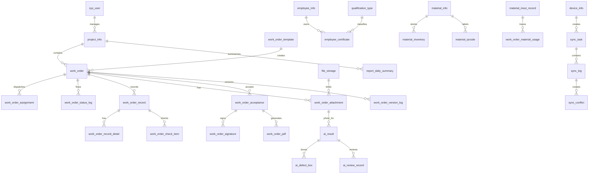

# Database Design Document

> Based on existing project files: `db/init_schema.sql`, `db/init_data.sql`, Flyway `V1__init_schema.sql`, and `V2__init_data.sql`. If this document conflicts with SQL files, use the SQL files as the source of truth.

## 1. Database Rules

- Database: MySQL 8.0.
- Engine: InnoDB.
- Charset: utf8mb4.
- Every table has `id`, `created_at`, `updated_at`, `deleted_flag`.
- Files are not stored as BLOB in MySQL. Only metadata and business bindings are stored.
- Foreign keys may be enforced by MySQL or treated as logical foreign keys according to deployment policy.

## 2. ER Topology

## 3. Table Groups

- **System permission**: `sys_user`, `sys_role`, `sys_permission`, `sys_user_role`, `sys_role_permission`, `operation_log`
- **Project and work order**: `project_info`, `work_order_template`, `work_order`, `work_order_status_log`, `work_order_assignment`, `work_order_material`
- **Field record**: `work_order_record`, `work_order_record_detail`, `work_order_check_item`
- **Attachment and file**: `file_storage`, `work_order_attachment`
- **Qualification**: `employee_info`, `qualification_type`, `employee_certificate`, `work_order_qualification_check`
- **Acceptance signature PDF**: `work_order_acceptance`, `work_order_signature`, `work_order_pdf`
- **Material trace**: `material_info`, `material_inventory`, `material_qrcode`, `material_inout_record`, `work_order_material_usage`
- **Offline sync**: `device_info`, `sync_task`, `sync_log`, `sync_conflict`, `work_order_version_log`
- **AI acceptance**: `ai_model_info`, `ai_result`, `ai_defect_box`, `ai_review_record`
- **Dashboard report**: `report_daily_summary`

## 4. Offline Sync Business Tables

The following tables include `local_id`, `server_id`, `version`, `sync_status`, `device_id`, and `operator_id`, and must be handled by the offline sync protocol:

- `project_info`
- `work_order_template`
- `work_order`
- `work_order_status_log`
- `work_order_assignment`
- `work_order_material`
- `work_order_record`
- `work_order_record_detail`
- `work_order_check_item`
- `file_storage`
- `work_order_attachment`
- `work_order_qualification_check`
- `work_order_acceptance`
- `work_order_signature`
- `work_order_pdf`
- `work_order_material_usage`
- `ai_result`
- `ai_defect_box`

### 4.1 Offline Sync Field Contract

| Field | Owner | Purpose | Rule |
|---|---|---|---|
| `local_id` | Mobile | Local SQLite/Realm/Room identity | Generated before server sync; used for idempotency and local-server mapping. |
| `server_id` | Server | Server `id` mapping | Returned after successful create; mobile must store it for later updates. |
| `version` | Server authoritative | Optimistic version | Update is allowed only when client version equals server version; success increments version by 1. |
| `sync_status` | Both | Sync lifecycle | `PENDING`, `SYNCING`, `SYNCED`, `FAILED`, `CONFLICT`; mobile local DB may additionally use `LOCAL_ONLY`. |
| `device_id` | Mobile | Source device trace | Required for retry, conflict, and audit. |
| `operator_id` | Login user | Last operator | Backend must validate data scope, especially maintainer self-scope. |
| `updated_at` | Server authoritative | Incremental cursor | Used by mobile pull and PC filters. |

## 5. Full Table Structure

### sys_user - 系统用户表

| Column | Type | Nullable | Key/Index | Default | Detailed Comment |
|---|---|---|---|---|---|
| `id` | `BIGINT` | No | PK | `` | 主键 |
| `username` | `VARCHAR(64)` | No | uk_sys_user_username | `` | 登录账号，唯一 |
| `password_hash` | `VARCHAR(255)` | No | - | `` | 密码哈希，不保存明文密码 |
| `real_name` | `VARCHAR(64)` | No | - | `` | 真实姓名 |
| `phone` | `VARCHAR(32)` | Yes | uk_sys_user_phone, idx_sys_user_mobile_login | `NULL` | 手机号，可用于移动端登录 |
| `email` | `VARCHAR(128)` | Yes | - | `NULL` | 邮箱 |
| `employee_no` | `VARCHAR(64)` | Yes | - | `NULL` | 员工编号 |
| `avatar_file_id` | `VARCHAR(64)` | Yes | - | `NULL` | 头像文件ID，对应 file_storage.file_id |
| `account_status` | `VARCHAR(32)` | No | idx_sys_user_status, idx_sys_user_mobile_login | `'ACTIVE'` | 账号状态：ACTIVE/DISABLED/LOCKED/EXPIRED See `02_Status_Enum_Dictionary.md` for enum details. |
| `pc_enabled` | `TINYINT` | No | - | `1` | 是否允许登录PC后台：0否，1是 See `02_Status_Enum_Dictionary.md` for enum details. |
| `mobile_enabled` | `TINYINT` | No | idx_sys_user_mobile_login | `1` | 是否允许登录移动端：0否，1是 See `02_Status_Enum_Dictionary.md` for enum details. |
| `primary_project_id` | `BIGINT` | Yes | idx_sys_user_project | `NULL` | 默认所属项目ID，项目表建立后可关联 project.id |
| `department_id` | `BIGINT` | Yes | idx_sys_user_department | `NULL` | 所属部门/班组ID，组织表建立后可关联 |
| `last_login_time` | `DATETIME` | Yes | - | `NULL` | 最后登录时间 |
| `last_login_ip` | `VARCHAR(64)` | Yes | - | `NULL` | 最后登录IP |
| `password_updated_at` | `DATETIME` | Yes | - | `NULL` | 密码最后修改时间 |
| `created_at` | `DATETIME` | No | - | `CURRENT_TIMESTAMP` | 创建时间 |
| `updated_at` | `DATETIME` | No | - | `CURRENT_TIMESTAMP ON UPDATE CURRENT_TIMESTAMP` | 更新时间 |
| `deleted_flag` | `TINYINT` | No | idx_sys_user_status | `0` | 逻辑删除：0未删除，1已删除 See `02_Status_Enum_Dictionary.md` for enum details. |
| `created_by` | `BIGINT` | Yes | - | `NULL` | 创建人ID |
| `updated_by` | `BIGINT` | Yes | - | `NULL` | 更新人ID |
| `remark` | `VARCHAR(500)` | Yes | - | `NULL` | 备注 |

**Indexes and constraints:**
- `PRIMARY KEY (id)`
- `UNIQUE KEY uk_sys_user_username (username)`
- `UNIQUE KEY uk_sys_user_phone (phone)`
- `KEY idx_sys_user_status (account_status, deleted_flag)`
- `KEY idx_sys_user_project (primary_project_id)`
- `KEY idx_sys_user_department (department_id)`
- `KEY idx_sys_user_mobile_login (phone, mobile_enabled, account_status)`

### sys_role - 系统角色表

| Column | Type | Nullable | Key/Index | Default | Detailed Comment |
|---|---|---|---|---|---|
| `id` | `BIGINT` | No | PK | `` | 主键 |
| `role_code` | `VARCHAR(64)` | No | uk_sys_role_code | `` | 角色编码，唯一 |
| `role_name` | `VARCHAR(64)` | No | - | `` | 角色名称 |
| `role_type` | `VARCHAR(32)` | No | - | `'BUSINESS'` | 角色类型：SYSTEM/BUSINESS See `02_Status_Enum_Dictionary.md` for enum details. |
| `data_scope` | `VARCHAR(32)` | No | idx_sys_role_data_scope | `'SELF'` | 数据范围：ALL/PROJECT/SELF/MATERIAL/QUALIFICATION/DASHBOARD/ACCEPTANCE See `02_Status_Enum_Dictionary.md` for enum details. |
| `pc_enabled` | `TINYINT` | No | - | `1` | 是否适用于PC后台 |
| `mobile_enabled` | `TINYINT` | No | - | `0` | 是否适用于移动端 |
| `sort_order` | `INT` | No | - | `0` | 排序 |
| `status` | `VARCHAR(32)` | No | idx_sys_role_status | `'ACTIVE'` | 状态：ACTIVE/DISABLED See `02_Status_Enum_Dictionary.md` for enum details. |
| `created_at` | `DATETIME` | No | - | `CURRENT_TIMESTAMP` | 创建时间 |
| `updated_at` | `DATETIME` | No | - | `CURRENT_TIMESTAMP ON UPDATE CURRENT_TIMESTAMP` | 更新时间 |
| `deleted_flag` | `TINYINT` | No | idx_sys_role_status | `0` | 逻辑删除：0未删除，1已删除 See `02_Status_Enum_Dictionary.md` for enum details. |
| `created_by` | `BIGINT` | Yes | - | `NULL` | 创建人ID |
| `updated_by` | `BIGINT` | Yes | - | `NULL` | 更新人ID |
| `remark` | `VARCHAR(500)` | Yes | - | `NULL` | 备注 |

**Indexes and constraints:**
- `PRIMARY KEY (id)`
- `UNIQUE KEY uk_sys_role_code (role_code)`
- `KEY idx_sys_role_status (status, deleted_flag)`
- `KEY idx_sys_role_data_scope (data_scope)`

### sys_permission - 系统权限表

| Column | Type | Nullable | Key/Index | Default | Detailed Comment |
|---|---|---|---|---|---|
| `id` | `BIGINT` | No | PK | `` | 主键 |
| `parent_id` | `BIGINT` | Yes | idx_sys_permission_parent | `NULL` | 父级权限ID |
| `permission_code` | `VARCHAR(128)` | No | uk_sys_permission_code | `` | 权限编码，唯一 |
| `permission_name` | `VARCHAR(128)` | No | - | `` | 权限名称 |
| `permission_type` | `VARCHAR(32)` | No | idx_sys_permission_type | `` | 权限类型：MENU/BUTTON/API See `02_Status_Enum_Dictionary.md` for enum details. |
| `platform` | `VARCHAR(32)` | No | idx_sys_permission_type | `'PC'` | 适用平台：PC/MOBILE/BOTH See `02_Status_Enum_Dictionary.md` for enum details. |
| `route_path` | `VARCHAR(255)` | Yes | - | `NULL` | PC前端路由 |
| `api_method` | `VARCHAR(16)` | Yes | idx_sys_permission_api | `NULL` | 接口方法：GET/POST/PUT/DELETE等 See `02_Status_Enum_Dictionary.md` for enum details. |
| `api_path` | `VARCHAR(255)` | Yes | idx_sys_permission_api | `NULL` | 后端接口路径 |
| `component_path` | `VARCHAR(255)` | Yes | - | `NULL` | PC页面组件路径 |
| `icon` | `VARCHAR(64)` | Yes | - | `NULL` | 菜单图标 |
| `sort_order` | `INT` | No | - | `0` | 排序 |
| `visible_flag` | `TINYINT` | No | - | `1` | 菜单是否可见：0否，1是 See `02_Status_Enum_Dictionary.md` for enum details. |
| `status` | `VARCHAR(32)` | No | idx_sys_permission_status | `'ACTIVE'` | 状态：ACTIVE/DISABLED See `02_Status_Enum_Dictionary.md` for enum details. |
| `created_at` | `DATETIME` | No | - | `CURRENT_TIMESTAMP` | 创建时间 |
| `updated_at` | `DATETIME` | No | - | `CURRENT_TIMESTAMP ON UPDATE CURRENT_TIMESTAMP` | 更新时间 |
| `deleted_flag` | `TINYINT` | No | idx_sys_permission_status | `0` | 逻辑删除：0未删除，1已删除 See `02_Status_Enum_Dictionary.md` for enum details. |
| `created_by` | `BIGINT` | Yes | - | `NULL` | 创建人ID |
| `updated_by` | `BIGINT` | Yes | - | `NULL` | 更新人ID |
| `remark` | `VARCHAR(500)` | Yes | - | `NULL` | 备注 |
| `FOREIGN` | `KEY (parent_id) REFERENCES sys_permission (id)` | Yes | - | `` |  |
| `ON` | `DELETE SET NULL ON UPDATE CASCADE` | Yes | - | `` |  |

**Indexes and constraints:**
- `PRIMARY KEY (id)`
- `UNIQUE KEY uk_sys_permission_code (permission_code)`
- `KEY idx_sys_permission_parent (parent_id)`
- `KEY idx_sys_permission_type (permission_type, platform)`
- `KEY idx_sys_permission_api (api_method, api_path)`
- `KEY idx_sys_permission_status (status, deleted_flag)`
- `CONSTRAINT fk_sys_permission_parent`

### sys_user_role - 用户角色关联表

| Column | Type | Nullable | Key/Index | Default | Detailed Comment |
|---|---|---|---|---|---|
| `id` | `BIGINT` | No | PK | `` | 主键 |
| `user_id` | `BIGINT` | No | uk_sys_user_role, idx_sys_user_role_user | `` | 用户ID |
| `role_id` | `BIGINT` | No | uk_sys_user_role, idx_sys_user_role_role | `` | 角色ID |
| `created_at` | `DATETIME` | No | - | `CURRENT_TIMESTAMP` | 创建时间 |
| `updated_at` | `DATETIME` | No | - | `CURRENT_TIMESTAMP ON UPDATE CURRENT_TIMESTAMP` | 更新时间 |
| `deleted_flag` | `TINYINT` | No | uk_sys_user_role | `0` | 逻辑删除：0未删除，1已删除 See `02_Status_Enum_Dictionary.md` for enum details. |
| `created_by` | `BIGINT` | Yes | - | `NULL` | 创建人ID |
| `updated_by` | `BIGINT` | Yes | - | `NULL` | 更新人ID |
| `remark` | `VARCHAR(500)` | Yes | - | `NULL` | 备注 |
| `FOREIGN` | `KEY (user_id) REFERENCES sys_user (id)` | Yes | - | `` |  |
| `ON` | `DELETE CASCADE ON UPDATE CASCADE` | Yes | - | `` |  |
| `FOREIGN` | `KEY (role_id) REFERENCES sys_role (id)` | Yes | - | `` |  |
| `ON` | `DELETE CASCADE ON UPDATE CASCADE` | Yes | - | `` |  |

**Indexes and constraints:**
- `PRIMARY KEY (id)`
- `UNIQUE KEY uk_sys_user_role (user_id, role_id, deleted_flag)`
- `KEY idx_sys_user_role_user (user_id)`
- `KEY idx_sys_user_role_role (role_id)`
- `CONSTRAINT fk_sys_user_role_user`
- `CONSTRAINT fk_sys_user_role_role`

### sys_role_permission - 角色权限关联表

| Column | Type | Nullable | Key/Index | Default | Detailed Comment |
|---|---|---|---|---|---|
| `id` | `BIGINT` | No | PK | `` | 主键 |
| `role_id` | `BIGINT` | No | uk_sys_role_permission, idx_sys_role_permission_role | `` | 角色ID |
| `permission_id` | `BIGINT` | No | uk_sys_role_permission, idx_sys_role_permission_permission | `` | 权限ID |
| `created_at` | `DATETIME` | No | - | `CURRENT_TIMESTAMP` | 创建时间 |
| `updated_at` | `DATETIME` | No | - | `CURRENT_TIMESTAMP ON UPDATE CURRENT_TIMESTAMP` | 更新时间 |
| `deleted_flag` | `TINYINT` | No | uk_sys_role_permission | `0` | 逻辑删除：0未删除，1已删除 See `02_Status_Enum_Dictionary.md` for enum details. |
| `created_by` | `BIGINT` | Yes | - | `NULL` | 创建人ID |
| `updated_by` | `BIGINT` | Yes | - | `NULL` | 更新人ID |
| `remark` | `VARCHAR(500)` | Yes | - | `NULL` | 备注 |
| `FOREIGN` | `KEY (role_id) REFERENCES sys_role (id)` | Yes | - | `` |  |
| `ON` | `DELETE CASCADE ON UPDATE CASCADE` | Yes | - | `` |  |
| `FOREIGN` | `KEY (permission_id) REFERENCES sys_permission (id)` | Yes | - | `` |  |
| `ON` | `DELETE CASCADE ON UPDATE CASCADE` | Yes | - | `` |  |

**Indexes and constraints:**
- `PRIMARY KEY (id)`
- `UNIQUE KEY uk_sys_role_permission (role_id, permission_id, deleted_flag)`
- `KEY idx_sys_role_permission_role (role_id)`
- `KEY idx_sys_role_permission_permission (permission_id)`
- `CONSTRAINT fk_sys_role_permission_role`
- `CONSTRAINT fk_sys_role_permission_permission`

### operation_log - 操作日志表

| Column | Type | Nullable | Key/Index | Default | Detailed Comment |
|---|---|---|---|---|---|
| `id` | `BIGINT` | No | PK | `` | 主键 |
| `trace_id` | `VARCHAR(64)` | Yes | - | `NULL` | 链路追踪ID |
| `operator_id` | `BIGINT` | Yes | idx_operation_log_operator | `NULL` | 操作人ID |
| `operator_name` | `VARCHAR(64)` | Yes | - | `NULL` | 操作人姓名 |
| `role_code` | `VARCHAR(64)` | Yes | - | `NULL` | 操作时角色编码 |
| `platform` | `VARCHAR(32)` | No | idx_operation_log_platform | `'PC'` | 操作平台：PC/MOBILE/SYNC/API See `02_Status_Enum_Dictionary.md` for enum details. |
| `module_name` | `VARCHAR(64)` | No | idx_operation_log_module | `` | 模块名称，如工单、物料、资质、同步、AI |
| `operation_type` | `VARCHAR(64)` | No | idx_operation_log_module | `` | 操作类型，如LOGIN/CREATE/UPDATE/DELETE/ASSIGN/EXPORT |
| `business_type` | `VARCHAR(64)` | Yes | idx_operation_log_business | `NULL` | 业务类型，如WORK_ORDER/MATERIAL/CERTIFICATE |
| `business_id` | `VARCHAR(64)` | Yes | idx_operation_log_business | `NULL` | 业务ID，字符串避免前端精度问题 |
| `business_no` | `VARCHAR(128)` | Yes | idx_operation_log_business_no | `NULL` | 业务编号，如工单编号 |
| `project_id` | `BIGINT` | Yes | idx_operation_log_project | `NULL` | 项目ID，用于项目经理数据范围和统计 |
| `device_id` | `VARCHAR(128)` | Yes | idx_operation_log_platform | `NULL` | 移动端设备ID |
| `request_method` | `VARCHAR(16)` | Yes | - | `NULL` | 请求方法 |
| `request_path` | `VARCHAR(255)` | Yes | - | `NULL` | 请求路径 |
| `request_ip` | `VARCHAR(64)` | Yes | - | `NULL` | 请求IP |
| `user_agent` | `VARCHAR(500)` | Yes | - | `NULL` | 客户端信息 |
| `request_body` | `JSON` | Yes | - | `NULL` | 脱敏后的请求体，不保存密码、token和大payload |
| `result_status` | `VARCHAR(32)` | No | idx_operation_log_result | `'SUCCESS'` | 结果：SUCCESS/FAILED See `02_Status_Enum_Dictionary.md` for enum details. |
| `error_code` | `VARCHAR(64)` | Yes | - | `NULL` | 错误码 |
| `error_message` | `VARCHAR(500)` | Yes | - | `NULL` | 错误信息 |
| `operation_time` | `DATETIME` | No | idx_operation_log_operator, idx_operation_log_project, idx_operation_log_result | `CURRENT_TIMESTAMP` | 业务操作时间 |
| `created_at` | `DATETIME` | No | - | `CURRENT_TIMESTAMP` | 创建时间 |
| `updated_at` | `DATETIME` | No | - | `CURRENT_TIMESTAMP ON UPDATE CURRENT_TIMESTAMP` | 更新时间 |
| `deleted_flag` | `TINYINT` | No | - | `0` | 逻辑删除：0未删除，1已删除 See `02_Status_Enum_Dictionary.md` for enum details. |
| `created_by` | `BIGINT` | Yes | - | `NULL` | 创建人ID |
| `updated_by` | `BIGINT` | Yes | - | `NULL` | 更新人ID |
| `remark` | `VARCHAR(500)` | Yes | - | `NULL` | 备注 |
| `FOREIGN` | `KEY (operator_id) REFERENCES sys_user (id)` | Yes | - | `` |  |
| `ON` | `DELETE SET NULL ON UPDATE CASCADE` | Yes | - | `` |  |

**Indexes and constraints:**
- `PRIMARY KEY (id)`
- `KEY idx_operation_log_operator (operator_id, operation_time)`
- `KEY idx_operation_log_business (business_type, business_id)`
- `KEY idx_operation_log_business_no (business_no)`
- `KEY idx_operation_log_project (project_id, operation_time)`
- `KEY idx_operation_log_module (module_name, operation_type)`
- `KEY idx_operation_log_platform (platform, device_id)`
- `KEY idx_operation_log_result (result_status, operation_time)`
- `CONSTRAINT fk_operation_log_operator`

### project_info - 项目信息表

| Column | Type | Nullable | Key/Index | Default | Detailed Comment |
|---|---|---|---|---|---|
| `id` | `BIGINT` | No | PK | `` | 主键 |
| `project_code` | `VARCHAR(64)` | No | uk_project_info_code | `` | 项目编号，建议唯一 |
| `project_name` | `VARCHAR(128)` | No | - | `` | 项目名称 |
| `platform_name` | `VARCHAR(128)` | Yes | - | `NULL` | 海上平台名称 |
| `owner_unit` | `VARCHAR(128)` | Yes | - | `NULL` | 业主单位 |
| `contractor_unit` | `VARCHAR(128)` | Yes | - | `NULL` | 施工单位 |
| `project_manager_id` | `BIGINT` | Yes | idx_project_info_manager | `NULL` | 项目经理ID，关联sys_user.id |
| `project_location` | `VARCHAR(255)` | Yes | - | `NULL` | 项目地点 |
| `start_date` | `DATE` | Yes | idx_project_info_time | `NULL` | 项目开始日期 |
| `end_date` | `DATE` | Yes | idx_project_info_time | `NULL` | 项目结束日期 |
| `project_status` | `VARCHAR(32)` | No | idx_project_info_status | `'ACTIVE'` | 项目状态：ACTIVE/SUSPENDED/COMPLETED/CLOSED See `02_Status_Enum_Dictionary.md` for enum details. |
| `sort_order` | `INT` | No | - | `0` | 排序 |
| `local_id` | `VARCHAR(128)` | Yes | uk_project_info_local_id | `NULL` | 移动端本地ID |
| `server_id` | `BIGINT` | Yes | - | `NULL` | 服务端ID映射，回传移动端使用 |
| `version` | `INT` | No | - | `0` | 同步版本号 |
| `sync_status` | `VARCHAR(32)` | No | idx_project_info_sync | `'SYNCED'` | 同步状态：PENDING/SYNCING/SYNCED/FAILED/CONFLICT See `02_Status_Enum_Dictionary.md` for enum details. |
| `device_id` | `VARCHAR(128)` | Yes | - | `NULL` | 来源设备ID |
| `operator_id` | `BIGINT` | Yes | - | `NULL` | 最后操作人ID |
| `created_at` | `DATETIME` | No | - | `CURRENT_TIMESTAMP` | 创建时间 |
| `updated_at` | `DATETIME` | No | idx_project_info_sync | `CURRENT_TIMESTAMP ON UPDATE CURRENT_TIMESTAMP` | 更新时间 |
| `deleted_flag` | `TINYINT` | No | idx_project_info_status | `0` | 逻辑删除：0未删除，1已删除 See `02_Status_Enum_Dictionary.md` for enum details. |
| `created_by` | `BIGINT` | Yes | - | `NULL` | 创建人ID |
| `updated_by` | `BIGINT` | Yes | - | `NULL` | 更新人ID |
| `remark` | `VARCHAR(500)` | Yes | - | `NULL` | 备注 |
| `FOREIGN` | `KEY (project_manager_id) REFERENCES sys_user (id)` | Yes | - | `` |  |
| `ON` | `DELETE SET NULL ON UPDATE CASCADE` | Yes | - | `` |  |
| `FOREIGN` | `KEY (operator_id) REFERENCES sys_user (id)` | Yes | - | `` |  |
| `ON` | `DELETE SET NULL ON UPDATE CASCADE` | Yes | - | `` |  |

**Indexes and constraints:**
- `PRIMARY KEY (id)`
- `UNIQUE KEY uk_project_info_code (project_code)`
- `UNIQUE KEY uk_project_info_local_id (local_id)`
- `KEY idx_project_info_manager (project_manager_id)`
- `KEY idx_project_info_status (project_status, deleted_flag)`
- `KEY idx_project_info_time (start_date, end_date)`
- `KEY idx_project_info_sync (sync_status, updated_at)`
- `CONSTRAINT fk_project_info_manager`
- `CONSTRAINT fk_project_info_operator`

### work_order_template - 工单模板表

| Column | Type | Nullable | Key/Index | Default | Detailed Comment |
|---|---|---|---|---|---|
| `id` | `BIGINT` | No | PK | `` | 主键 |
| `template_code` | `VARCHAR(64)` | No | uk_work_order_template_code | `` | 模板编号，唯一 |
| `template_name` | `VARCHAR(128)` | No | - | `` | 模板名称 |
| `work_type` | `VARCHAR(64)` | Yes | idx_work_order_template_type | `NULL` | 作业类型 |
| `default_priority` | `VARCHAR(32)` | No | - | `'NORMAL'` | 默认优先级：LOW/NORMAL/HIGH/URGENT See `02_Status_Enum_Dictionary.md` for enum details. |
| `default_work_content` | `TEXT` | Yes | - | `NULL` | 默认作业内容 |
| `default_material_desc` | `TEXT` | Yes | - | `NULL` | 默认所需物料说明 |
| `default_duration_hours` | `DECIMAL(10,2)` | Yes | - | `NULL` | 默认计划工时 |
| `enabled_flag` | `TINYINT` | No | idx_work_order_template_type | `1` | 是否启用：0否，1是 See `02_Status_Enum_Dictionary.md` for enum details. |
| `local_id` | `VARCHAR(128)` | Yes | uk_work_order_template_local_id | `NULL` | 移动端本地ID |
| `server_id` | `BIGINT` | Yes | - | `NULL` | 服务端ID映射，回传移动端使用 |
| `version` | `INT` | No | - | `0` | 同步版本号 |
| `sync_status` | `VARCHAR(32)` | No | idx_work_order_template_sync | `'SYNCED'` | 同步状态：PENDING/SYNCING/SYNCED/FAILED/CONFLICT See `02_Status_Enum_Dictionary.md` for enum details. |
| `device_id` | `VARCHAR(128)` | Yes | - | `NULL` | 来源设备ID |
| `operator_id` | `BIGINT` | Yes | - | `NULL` | 最后操作人ID |
| `created_at` | `DATETIME` | No | - | `CURRENT_TIMESTAMP` | 创建时间 |
| `updated_at` | `DATETIME` | No | idx_work_order_template_sync | `CURRENT_TIMESTAMP ON UPDATE CURRENT_TIMESTAMP` | 更新时间 |
| `deleted_flag` | `TINYINT` | No | - | `0` | 逻辑删除：0未删除，1已删除 See `02_Status_Enum_Dictionary.md` for enum details. |
| `created_by` | `BIGINT` | Yes | - | `NULL` | 创建人ID |
| `updated_by` | `BIGINT` | Yes | - | `NULL` | 更新人ID |
| `remark` | `VARCHAR(500)` | Yes | - | `NULL` | 备注 |
| `FOREIGN` | `KEY (operator_id) REFERENCES sys_user (id)` | Yes | - | `` |  |
| `ON` | `DELETE SET NULL ON UPDATE CASCADE` | Yes | - | `` |  |

**Indexes and constraints:**
- `PRIMARY KEY (id)`
- `UNIQUE KEY uk_work_order_template_code (template_code)`
- `UNIQUE KEY uk_work_order_template_local_id (local_id)`
- `KEY idx_work_order_template_type (work_type, enabled_flag)`
- `KEY idx_work_order_template_sync (sync_status, updated_at)`
- `CONSTRAINT fk_work_order_template_operator`

### work_order - 工单主表

| Column | Type | Nullable | Key/Index | Default | Detailed Comment |
|---|---|---|---|---|---|
| `id` | `BIGINT` | No | PK | `` | 主键 |
| `work_order_no` | `VARCHAR(64)` | No | uk_work_order_no | `` | 工单编号，唯一 |
| `project_id` | `BIGINT` | No | idx_work_order_project_status | `` | 项目ID，关联project_info.id |
| `template_id` | `BIGINT` | Yes | - | `NULL` | 模板ID，关联work_order_template.id |
| `work_title` | `VARCHAR(128)` | No | - | `` | 工单标题 |
| `work_type` | `VARCHAR(64)` | Yes | - | `NULL` | 作业类型 |
| `work_location` | `VARCHAR(255)` | No | - | `` | 作业地点，移动端派工单展示 |
| `work_content` | `TEXT` | No | - | `` | 作业内容，移动端派工单展示 |
| `required_material_desc` | `TEXT` | Yes | - | `NULL` | 所需物料说明，移动端派工单展示 |
| `leader_id` | `BIGINT` | Yes | idx_work_order_people | `NULL` | 负责人ID，关联sys_user.id |
| `maintainer_id` | `BIGINT` | Yes | idx_work_order_people, idx_work_order_mobile_list | `NULL` | 主维修工ID，关联sys_user.id |
| `planned_start_time` | `DATETIME` | Yes | idx_work_order_time | `NULL` | 计划开始时间 |
| `planned_end_time` | `DATETIME` | Yes | idx_work_order_time | `NULL` | 计划结束时间 |
| `actual_start_time` | `DATETIME` | Yes | idx_work_order_time | `NULL` | 实际开始时间 |
| `actual_end_time` | `DATETIME` | Yes | idx_work_order_time | `NULL` | 实际结束时间 |
| `status` | `VARCHAR(32)` | No | idx_work_order_project_status, idx_work_order_priority, idx_work_order_mobile_list | `'PENDING_ASSIGN'` | 状态：PENDING_ASSIGN/ASSIGNED/IN_PROGRESS/PENDING_ACCEPTANCE/COMPLETED/REJECTED/CLOSED See `02_Status_Enum_Dictionary.md` for enum details. |
| `priority` | `VARCHAR(32)` | No | idx_work_order_priority | `'NORMAL'` | 优先级：LOW/NORMAL/HIGH/URGENT See `02_Status_Enum_Dictionary.md` for enum details. |
| `reject_reason` | `VARCHAR(500)` | Yes | - | `NULL` | 驳回原因 |
| `close_reason` | `VARCHAR(500)` | Yes | - | `NULL` | 关闭原因 |
| `acceptance_required` | `TINYINT` | No | - | `1` | 是否需要验收：0否，1是 See `02_Status_Enum_Dictionary.md` for enum details. |
| `source_type` | `VARCHAR(32)` | No | - | `'PC'` | 来源：PC/MOBILE/SYNC/TEMPLATE See `02_Status_Enum_Dictionary.md` for enum details. |
| `local_id` | `VARCHAR(128)` | Yes | uk_work_order_local_id | `NULL` | 移动端本地ID |
| `server_id` | `BIGINT` | Yes | - | `NULL` | 服务端ID映射，回传移动端使用 |
| `version` | `INT` | No | - | `0` | 同步版本号 |
| `sync_status` | `VARCHAR(32)` | No | idx_work_order_sync | `'SYNCED'` | 同步状态：PENDING/SYNCING/SYNCED/FAILED/CONFLICT See `02_Status_Enum_Dictionary.md` for enum details. |
| `device_id` | `VARCHAR(128)` | Yes | - | `NULL` | 来源设备ID |
| `operator_id` | `BIGINT` | Yes | - | `NULL` | 最后操作人ID |
| `created_at` | `DATETIME` | No | - | `CURRENT_TIMESTAMP` | 创建时间 |
| `updated_at` | `DATETIME` | No | idx_work_order_sync, idx_work_order_mobile_list | `CURRENT_TIMESTAMP ON UPDATE CURRENT_TIMESTAMP` | 更新时间 |
| `deleted_flag` | `TINYINT` | No | idx_work_order_project_status | `0` | 逻辑删除：0未删除，1已删除 See `02_Status_Enum_Dictionary.md` for enum details. |
| `created_by` | `BIGINT` | Yes | - | `NULL` | 创建人ID |
| `updated_by` | `BIGINT` | Yes | - | `NULL` | 更新人ID |
| `remark` | `VARCHAR(500)` | Yes | - | `NULL` | 备注 |
| `FOREIGN` | `KEY (project_id) REFERENCES project_info (id)` | Yes | - | `` |  |
| `ON` | `DELETE RESTRICT ON UPDATE CASCADE` | Yes | - | `` |  |
| `FOREIGN` | `KEY (template_id) REFERENCES work_order_template (id)` | Yes | - | `` |  |
| `ON` | `DELETE SET NULL ON UPDATE CASCADE` | Yes | - | `` |  |
| `FOREIGN` | `KEY (leader_id) REFERENCES sys_user (id)` | Yes | - | `` |  |
| `ON` | `DELETE SET NULL ON UPDATE CASCADE` | Yes | - | `` |  |
| `FOREIGN` | `KEY (maintainer_id) REFERENCES sys_user (id)` | Yes | - | `` |  |
| `ON` | `DELETE SET NULL ON UPDATE CASCADE` | Yes | - | `` |  |
| `FOREIGN` | `KEY (operator_id) REFERENCES sys_user (id)` | Yes | - | `` |  |
| `ON` | `DELETE SET NULL ON UPDATE CASCADE` | Yes | - | `` |  |

**Indexes and constraints:**
- `PRIMARY KEY (id)`
- `UNIQUE KEY uk_work_order_no (work_order_no)`
- `UNIQUE KEY uk_work_order_local_id (local_id)`
- `KEY idx_work_order_project_status (project_id, status, deleted_flag)`
- `KEY idx_work_order_time (planned_start_time, planned_end_time, actual_start_time, actual_end_time)`
- `KEY idx_work_order_people (leader_id, maintainer_id)`
- `KEY idx_work_order_priority (priority, status)`
- `KEY idx_work_order_sync (sync_status, updated_at)`
- `KEY idx_work_order_mobile_list (maintainer_id, status, updated_at)`
- `CONSTRAINT fk_work_order_project`
- `CONSTRAINT fk_work_order_template`
- `CONSTRAINT fk_work_order_leader`
- `CONSTRAINT fk_work_order_maintainer`
- `CONSTRAINT fk_work_order_operator`

### work_order_status_log - 工单状态流转表

| Column | Type | Nullable | Key/Index | Default | Detailed Comment |
|---|---|---|---|---|---|
| `id` | `BIGINT` | No | PK | `` | 主键 |
| `work_order_id` | `BIGINT` | No | idx_work_order_status_log_order | `` | 工单ID |
| `from_status` | `VARCHAR(32)` | Yes | idx_work_order_status_log_status | `NULL` | 变更前状态 |
| `to_status` | `VARCHAR(32)` | No | idx_work_order_status_log_status | `` | 变更后状态 |
| `operation_type` | `VARCHAR(64)` | No | - | `` | 操作类型：CREATE/ASSIGN/START/SUBMIT_ACCEPTANCE/COMPLETE/REJECT/CLOSE See `02_Status_Enum_Dictionary.md` for enum details. |
| `operation_desc` | `VARCHAR(500)` | Yes | - | `NULL` | 状态流转说明 |
| `operator_id` | `BIGINT` | Yes | idx_work_order_status_log_operator | `NULL` | 操作人ID |
| `operation_time` | `DATETIME` | No | idx_work_order_status_log_order, idx_work_order_status_log_operator | `CURRENT_TIMESTAMP` | 操作时间 |
| `local_id` | `VARCHAR(128)` | Yes | uk_work_order_status_log_local_id | `NULL` | 移动端本地ID |
| `server_id` | `BIGINT` | Yes | - | `NULL` | 服务端ID映射，回传移动端使用 |
| `version` | `INT` | No | - | `0` | 同步版本号 |
| `sync_status` | `VARCHAR(32)` | No | idx_work_order_status_log_sync | `'SYNCED'` | 同步状态：PENDING/SYNCING/SYNCED/FAILED/CONFLICT See `02_Status_Enum_Dictionary.md` for enum details. |
| `device_id` | `VARCHAR(128)` | Yes | - | `NULL` | 来源设备ID |
| `created_at` | `DATETIME` | No | - | `CURRENT_TIMESTAMP` | 创建时间 |
| `updated_at` | `DATETIME` | No | idx_work_order_status_log_sync | `CURRENT_TIMESTAMP ON UPDATE CURRENT_TIMESTAMP` | 更新时间 |
| `deleted_flag` | `TINYINT` | No | - | `0` | 逻辑删除：0未删除，1已删除 See `02_Status_Enum_Dictionary.md` for enum details. |
| `created_by` | `BIGINT` | Yes | - | `NULL` | 创建人ID |
| `updated_by` | `BIGINT` | Yes | - | `NULL` | 更新人ID |
| `remark` | `VARCHAR(500)` | Yes | - | `NULL` | 备注 |
| `FOREIGN` | `KEY (work_order_id) REFERENCES work_order (id)` | Yes | - | `` |  |
| `ON` | `DELETE CASCADE ON UPDATE CASCADE` | Yes | - | `` |  |
| `FOREIGN` | `KEY (operator_id) REFERENCES sys_user (id)` | Yes | - | `` |  |
| `ON` | `DELETE SET NULL ON UPDATE CASCADE` | Yes | - | `` |  |

**Indexes and constraints:**
- `PRIMARY KEY (id)`
- `UNIQUE KEY uk_work_order_status_log_local_id (local_id)`
- `KEY idx_work_order_status_log_order (work_order_id, operation_time)`
- `KEY idx_work_order_status_log_status (from_status, to_status)`
- `KEY idx_work_order_status_log_operator (operator_id, operation_time)`
- `KEY idx_work_order_status_log_sync (sync_status, updated_at)`
- `CONSTRAINT fk_work_order_status_log_order`
- `CONSTRAINT fk_work_order_status_log_operator`

### work_order_assignment - 工单派工表

| Column | Type | Nullable | Key/Index | Default | Detailed Comment |
|---|---|---|---|---|---|
| `id` | `BIGINT` | No | PK | `` | 主键 |
| `work_order_id` | `BIGINT` | No | idx_work_order_assignment_order | `` | 工单ID |
| `assigner_id` | `BIGINT` | Yes | idx_work_order_assignment_assigner | `NULL` | 派工人ID |
| `assignee_id` | `BIGINT` | No | idx_work_order_assignment_assignee | `` | 维修工/执行人ID |
| `assignment_role` | `VARCHAR(32)` | No | - | `'MAINTAINER'` | 派工角色：LEADER/MAINTAINER/ACCEPTOR See `02_Status_Enum_Dictionary.md` for enum details. |
| `assignment_status` | `VARCHAR(32)` | No | idx_work_order_assignment_order, idx_work_order_assignment_assignee | `'ASSIGNED'` | 派工状态：ASSIGNED/ACCEPTED/REJECTED/CANCELLED/COMPLETED See `02_Status_Enum_Dictionary.md` for enum details. |
| `assigned_at` | `DATETIME` | No | idx_work_order_assignment_assigner | `CURRENT_TIMESTAMP` | 派工时间 |
| `accepted_at` | `DATETIME` | Yes | - | `NULL` | 接单时间 |
| `rejected_at` | `DATETIME` | Yes | - | `NULL` | 拒单时间 |
| `completed_at` | `DATETIME` | Yes | - | `NULL` | 完成时间 |
| `reject_reason` | `VARCHAR(500)` | Yes | - | `NULL` | 拒单原因 |
| `local_id` | `VARCHAR(128)` | Yes | uk_work_order_assignment_local_id | `NULL` | 移动端本地ID |
| `server_id` | `BIGINT` | Yes | - | `NULL` | 服务端ID映射，回传移动端使用 |
| `version` | `INT` | No | - | `0` | 同步版本号 |
| `sync_status` | `VARCHAR(32)` | No | idx_work_order_assignment_sync | `'SYNCED'` | 同步状态：PENDING/SYNCING/SYNCED/FAILED/CONFLICT See `02_Status_Enum_Dictionary.md` for enum details. |
| `device_id` | `VARCHAR(128)` | Yes | - | `NULL` | 来源设备ID |
| `operator_id` | `BIGINT` | Yes | - | `NULL` | 最后操作人ID |
| `created_at` | `DATETIME` | No | - | `CURRENT_TIMESTAMP` | 创建时间 |
| `updated_at` | `DATETIME` | No | idx_work_order_assignment_assignee, idx_work_order_assignment_sync | `CURRENT_TIMESTAMP ON UPDATE CURRENT_TIMESTAMP` | 更新时间 |
| `deleted_flag` | `TINYINT` | No | - | `0` | 逻辑删除：0未删除，1已删除 See `02_Status_Enum_Dictionary.md` for enum details. |
| `created_by` | `BIGINT` | Yes | - | `NULL` | 创建人ID |
| `updated_by` | `BIGINT` | Yes | - | `NULL` | 更新人ID |
| `remark` | `VARCHAR(500)` | Yes | - | `NULL` | 备注 |
| `FOREIGN` | `KEY (work_order_id) REFERENCES work_order (id)` | Yes | - | `` |  |
| `ON` | `DELETE CASCADE ON UPDATE CASCADE` | Yes | - | `` |  |
| `FOREIGN` | `KEY (assigner_id) REFERENCES sys_user (id)` | Yes | - | `` |  |
| `ON` | `DELETE SET NULL ON UPDATE CASCADE` | Yes | - | `` |  |
| `FOREIGN` | `KEY (assignee_id) REFERENCES sys_user (id)` | Yes | - | `` |  |
| `ON` | `DELETE RESTRICT ON UPDATE CASCADE` | Yes | - | `` |  |
| `FOREIGN` | `KEY (operator_id) REFERENCES sys_user (id)` | Yes | - | `` |  |
| `ON` | `DELETE SET NULL ON UPDATE CASCADE` | Yes | - | `` |  |

**Indexes and constraints:**
- `PRIMARY KEY (id)`
- `UNIQUE KEY uk_work_order_assignment_local_id (local_id)`
- `KEY idx_work_order_assignment_order (work_order_id, assignment_status)`
- `KEY idx_work_order_assignment_assignee (assignee_id, assignment_status, updated_at)`
- `KEY idx_work_order_assignment_assigner (assigner_id, assigned_at)`
- `KEY idx_work_order_assignment_sync (sync_status, updated_at)`
- `CONSTRAINT fk_work_order_assignment_order`
- `CONSTRAINT fk_work_order_assignment_assigner`
- `CONSTRAINT fk_work_order_assignment_assignee`
- `CONSTRAINT fk_work_order_assignment_operator`

### work_order_material - 工单所需物料表

| Column | Type | Nullable | Key/Index | Default | Detailed Comment |
|---|---|---|---|---|---|
| `id` | `BIGINT` | No | PK | `` | 主键 |
| `work_order_id` | `BIGINT` | No | idx_work_order_material_order | `` | 工单ID |
| `material_code` | `VARCHAR(64)` | Yes | idx_work_order_material_code | `NULL` | 物料编号，后续可关联material.material_code |
| `material_name` | `VARCHAR(128)` | No | - | `` | 物料名称 |
| `material_spec` | `VARCHAR(128)` | Yes | - | `NULL` | 规格型号 |
| `unit` | `VARCHAR(32)` | Yes | - | `NULL` | 单位 |
| `planned_qty` | `DECIMAL(14,3)` | No | - | `0` | 计划所需数量 |
| `actual_qty` | `DECIMAL(14,3)` | No | - | `0` | 实际使用数量，后续由物料使用记录汇总 |
| `material_desc` | `VARCHAR(500)` | Yes | - | `NULL` | 物料说明，移动端派工单展示 |
| `required_flag` | `TINYINT` | No | - | `1` | 是否必需：0否，1是 See `02_Status_Enum_Dictionary.md` for enum details. |
| `prepare_status` | `VARCHAR(32)` | No | idx_work_order_material_order | `'PENDING'` | 备料状态：PENDING/PREPARED/PARTIAL/SHORTAGE See `02_Status_Enum_Dictionary.md` for enum details. |
| `local_id` | `VARCHAR(128)` | Yes | uk_work_order_material_local_id | `NULL` | 移动端本地ID |
| `server_id` | `BIGINT` | Yes | - | `NULL` | 服务端ID映射，回传移动端使用 |
| `version` | `INT` | No | - | `0` | 同步版本号 |
| `sync_status` | `VARCHAR(32)` | No | idx_work_order_material_sync | `'SYNCED'` | 同步状态：PENDING/SYNCING/SYNCED/FAILED/CONFLICT See `02_Status_Enum_Dictionary.md` for enum details. |
| `device_id` | `VARCHAR(128)` | Yes | - | `NULL` | 来源设备ID |
| `operator_id` | `BIGINT` | Yes | - | `NULL` | 最后操作人ID |
| `created_at` | `DATETIME` | No | - | `CURRENT_TIMESTAMP` | 创建时间 |
| `updated_at` | `DATETIME` | No | idx_work_order_material_sync | `CURRENT_TIMESTAMP ON UPDATE CURRENT_TIMESTAMP` | 更新时间 |
| `deleted_flag` | `TINYINT` | No | - | `0` | 逻辑删除：0未删除，1已删除 See `02_Status_Enum_Dictionary.md` for enum details. |
| `created_by` | `BIGINT` | Yes | - | `NULL` | 创建人ID |
| `updated_by` | `BIGINT` | Yes | - | `NULL` | 更新人ID |
| `remark` | `VARCHAR(500)` | Yes | - | `NULL` | 备注 |
| `FOREIGN` | `KEY (work_order_id) REFERENCES work_order (id)` | Yes | - | `` |  |
| `ON` | `DELETE CASCADE ON UPDATE CASCADE` | Yes | - | `` |  |
| `FOREIGN` | `KEY (operator_id) REFERENCES sys_user (id)` | Yes | - | `` |  |
| `ON` | `DELETE SET NULL ON UPDATE CASCADE` | Yes | - | `` |  |

**Indexes and constraints:**
- `PRIMARY KEY (id)`
- `UNIQUE KEY uk_work_order_material_local_id (local_id)`
- `KEY idx_work_order_material_order (work_order_id, prepare_status)`
- `KEY idx_work_order_material_code (material_code)`
- `KEY idx_work_order_material_sync (sync_status, updated_at)`
- `CONSTRAINT fk_work_order_material_order`
- `CONSTRAINT fk_work_order_material_operator`

### work_order_record - 施工记录表

| Column | Type | Nullable | Key/Index | Default | Detailed Comment |
|---|---|---|---|---|---|
| `id` | `BIGINT` | No | PK, idx_work_order_record_ai_bind | `` | 主键 |
| `work_order_id` | `BIGINT` | No | idx_work_order_record_order, idx_work_order_record_ai_bind | `` | 工单ID，关联work_order.id |
| `project_id` | `BIGINT` | No | idx_work_order_record_project_time | `` | 项目ID，冗余用于PC后台筛选统计 |
| `record_no` | `VARCHAR(64)` | Yes | uk_work_order_record_no | `NULL` | 施工记录编号 |
| `record_type` | `VARCHAR(32)` | No | - | `'CONSTRUCTION'` | 记录类型：CONSTRUCTION/FEEDBACK/EXCEPTION/ACCEPTANCE_PREP See `02_Status_Enum_Dictionary.md` for enum details. |
| `construction_time` | `DATETIME` | No | idx_work_order_record_order, idx_work_order_record_project_time, idx_work_order_record_user_time | `` | 施工时间，移动端现场填写时间 |
| `construction_user_id` | `BIGINT` | No | idx_work_order_record_user_time | `` | 施工人员ID，关联sys_user.id |
| `construction_user_name` | `VARCHAR(64)` | Yes | - | `NULL` | 施工人员姓名快照 |
| `construction_desc` | `TEXT` | No | - | `` | 施工描述 |
| `site_condition` | `TEXT` | Yes | - | `NULL` | 现场情况 |
| `abnormal_flag` | `TINYINT` | No | idx_work_order_record_status | `0` | 是否异常：0否，1是 See `02_Status_Enum_Dictionary.md` for enum details. |
| `abnormal_desc` | `VARCHAR(1000)` | Yes | - | `NULL` | 异常说明 |
| `weather` | `VARCHAR(64)` | Yes | - | `NULL` | 天气 |
| `temperature` | `DECIMAL(6,2)` | Yes | - | `NULL` | 现场温度 |
| `humidity` | `DECIMAL(6,2)` | Yes | - | `NULL` | 现场湿度 |
| `location_name` | `VARCHAR(255)` | Yes | - | `NULL` | 现场位置名称 |
| `latitude` | `DECIMAL(10,7)` | Yes | - | `NULL` | 纬度 |
| `longitude` | `DECIMAL(10,7)` | Yes | - | `NULL` | 经度 |
| `altitude` | `DECIMAL(10,2)` | Yes | - | `NULL` | 海拔/高度 |
| `attachment_count` | `INT` | No | idx_work_order_record_ai_bind | `0` | 附件数量，照片/视频/语音等统计 |
| `ai_result_count` | `INT` | No | idx_work_order_record_ai_bind | `0` | AI识别结果数量 |
| `record_status` | `VARCHAR(32)` | No | idx_work_order_record_status | `'DRAFT'` | 记录状态：DRAFT/SUBMITTED/REJECTED/CONFIRMED See `02_Status_Enum_Dictionary.md` for enum details. |
| `submitted_at` | `DATETIME` | Yes | - | `NULL` | 提交时间 |
| `confirmed_by` | `BIGINT` | Yes | - | `NULL` | PC后台确认人ID |
| `confirmed_at` | `DATETIME` | Yes | - | `NULL` | PC后台确认时间 |
| `client_created_at` | `DATETIME` | Yes | - | `NULL` | 移动端本地创建时间 |
| `client_updated_at` | `DATETIME` | Yes | - | `NULL` | 移动端本地更新时间 |
| `local_id` | `VARCHAR(128)` | Yes | uk_work_order_record_local_id | `NULL` | 移动端本地ID |
| `server_id` | `BIGINT` | Yes | - | `NULL` | 服务端ID映射，回传移动端使用 |
| `version` | `INT` | No | - | `0` | 同步版本号，用于增量同步和冲突判断 |
| `sync_status` | `VARCHAR(32)` | No | idx_work_order_record_sync | `'PENDING'` | 同步状态：PENDING/SYNCING/SYNCED/FAILED/CONFLICT See `02_Status_Enum_Dictionary.md` for enum details. |
| `device_id` | `VARCHAR(128)` | Yes | - | `NULL` | 来源设备ID |
| `operator_id` | `BIGINT` | Yes | - | `NULL` | 最后操作人ID |
| `conflict_flag` | `TINYINT` | No | - | `0` | 是否存在同步冲突：0否，1是 See `02_Status_Enum_Dictionary.md` for enum details. |
| `created_at` | `DATETIME` | No | - | `CURRENT_TIMESTAMP` | 创建时间 |
| `updated_at` | `DATETIME` | No | idx_work_order_record_sync | `CURRENT_TIMESTAMP ON UPDATE CURRENT_TIMESTAMP` | 更新时间 |
| `deleted_flag` | `TINYINT` | No | idx_work_order_record_status | `0` | 逻辑删除：0未删除，1已删除 See `02_Status_Enum_Dictionary.md` for enum details. |
| `created_by` | `BIGINT` | Yes | - | `NULL` | 创建人ID |
| `updated_by` | `BIGINT` | Yes | - | `NULL` | 更新人ID |
| `remark` | `VARCHAR(500)` | Yes | - | `NULL` | 备注 |
| `FOREIGN` | `KEY (work_order_id) REFERENCES work_order (id)` | Yes | - | `` |  |
| `ON` | `DELETE CASCADE ON UPDATE CASCADE` | Yes | - | `` |  |
| `FOREIGN` | `KEY (project_id) REFERENCES project_info (id)` | Yes | - | `` |  |
| `ON` | `DELETE RESTRICT ON UPDATE CASCADE` | Yes | - | `` |  |
| `FOREIGN` | `KEY (construction_user_id) REFERENCES sys_user (id)` | Yes | - | `` |  |
| `ON` | `DELETE RESTRICT ON UPDATE CASCADE` | Yes | - | `` |  |
| `FOREIGN` | `KEY (confirmed_by) REFERENCES sys_user (id)` | Yes | - | `` |  |
| `ON` | `DELETE SET NULL ON UPDATE CASCADE` | Yes | - | `` |  |
| `FOREIGN` | `KEY (operator_id) REFERENCES sys_user (id)` | Yes | - | `` |  |
| `ON` | `DELETE SET NULL ON UPDATE CASCADE` | Yes | - | `` |  |

**Indexes and constraints:**
- `PRIMARY KEY (id)`
- `UNIQUE KEY uk_work_order_record_no (record_no)`
- `UNIQUE KEY uk_work_order_record_local_id (local_id)`
- `KEY idx_work_order_record_order (work_order_id, construction_time)`
- `KEY idx_work_order_record_project_time (project_id, construction_time)`
- `KEY idx_work_order_record_user_time (construction_user_id, construction_time)`
- `KEY idx_work_order_record_status (record_status, abnormal_flag, deleted_flag)`
- `KEY idx_work_order_record_sync (sync_status, updated_at)`
- `KEY idx_work_order_record_ai_bind (work_order_id, id, attachment_count, ai_result_count)`
- `CONSTRAINT fk_work_order_record_order`
- `CONSTRAINT fk_work_order_record_project`
- `CONSTRAINT fk_work_order_record_user`
- `CONSTRAINT fk_work_order_record_confirmed_by`
- `CONSTRAINT fk_work_order_record_operator`

### work_order_record_detail - 施工记录明细表

| Column | Type | Nullable | Key/Index | Default | Detailed Comment |
|---|---|---|---|---|---|
| `id` | `BIGINT` | No | PK | `` | 主键 |
| `work_order_id` | `BIGINT` | No | idx_work_order_record_detail_order | `` | 工单ID，关联work_order.id |
| `record_id` | `BIGINT` | No | idx_work_order_record_detail_record, idx_work_order_record_detail_ai_bind | `` | 施工记录ID，关联work_order_record.id |
| `detail_type` | `VARCHAR(32)` | No | idx_work_order_record_detail_order | `'TEXT'` | 明细类型：TEXT/STEP/MATERIAL/MEASURE/VOICE_TEXT/OTHER See `02_Status_Enum_Dictionary.md` for enum details. |
| `detail_title` | `VARCHAR(128)` | Yes | - | `NULL` | 明细标题 |
| `detail_content` | `TEXT` | Yes | - | `NULL` | 明细内容 |
| `step_no` | `INT` | Yes | - | `NULL` | 步骤序号 |
| `item_code` | `VARCHAR(64)` | Yes | - | `NULL` | 明细项编码 |
| `item_name` | `VARCHAR(128)` | Yes | - | `NULL` | 明细项名称 |
| `item_value` | `VARCHAR(500)` | Yes | - | `NULL` | 明细项值 |
| `item_unit` | `VARCHAR(32)` | Yes | - | `NULL` | 单位 |
| `normal_flag` | `TINYINT` | Yes | - | `NULL` | 是否正常：0否，1是，NULL不适用 See `02_Status_Enum_Dictionary.md` for enum details. |
| `abnormal_desc` | `VARCHAR(1000)` | Yes | - | `NULL` | 异常说明 |
| `attachment_ref_flag` | `TINYINT` | No | idx_work_order_record_detail_ai_bind | `0` | 是否有关联附件：0否，1是 See `02_Status_Enum_Dictionary.md` for enum details. |
| `ai_ref_flag` | `TINYINT` | No | idx_work_order_record_detail_ai_bind | `0` | 是否有关联AI结果：0否，1是 See `02_Status_Enum_Dictionary.md` for enum details. |
| `sort_order` | `INT` | No | idx_work_order_record_detail_record | `0` | 排序 |
| `client_created_at` | `DATETIME` | Yes | - | `NULL` | 移动端本地创建时间 |
| `client_updated_at` | `DATETIME` | Yes | - | `NULL` | 移动端本地更新时间 |
| `local_id` | `VARCHAR(128)` | Yes | uk_work_order_record_detail_local_id | `NULL` | 移动端本地ID |
| `server_id` | `BIGINT` | Yes | - | `NULL` | 服务端ID映射，回传移动端使用 |
| `version` | `INT` | No | - | `0` | 同步版本号，用于增量同步和冲突判断 |
| `sync_status` | `VARCHAR(32)` | No | idx_work_order_record_detail_sync | `'PENDING'` | 同步状态：PENDING/SYNCING/SYNCED/FAILED/CONFLICT See `02_Status_Enum_Dictionary.md` for enum details. |
| `device_id` | `VARCHAR(128)` | Yes | - | `NULL` | 来源设备ID |
| `operator_id` | `BIGINT` | Yes | - | `NULL` | 最后操作人ID |
| `conflict_flag` | `TINYINT` | No | - | `0` | 是否存在同步冲突：0否，1是 See `02_Status_Enum_Dictionary.md` for enum details. |
| `created_at` | `DATETIME` | No | - | `CURRENT_TIMESTAMP` | 创建时间 |
| `updated_at` | `DATETIME` | No | idx_work_order_record_detail_sync | `CURRENT_TIMESTAMP ON UPDATE CURRENT_TIMESTAMP` | 更新时间 |
| `deleted_flag` | `TINYINT` | No | - | `0` | 逻辑删除：0未删除，1已删除 See `02_Status_Enum_Dictionary.md` for enum details. |
| `created_by` | `BIGINT` | Yes | - | `NULL` | 创建人ID |
| `updated_by` | `BIGINT` | Yes | - | `NULL` | 更新人ID |
| `remark` | `VARCHAR(500)` | Yes | - | `NULL` | 备注 |
| `FOREIGN` | `KEY (work_order_id) REFERENCES work_order (id)` | Yes | - | `` |  |
| `ON` | `DELETE CASCADE ON UPDATE CASCADE` | Yes | - | `` |  |
| `FOREIGN` | `KEY (record_id) REFERENCES work_order_record (id)` | Yes | - | `` |  |
| `ON` | `DELETE CASCADE ON UPDATE CASCADE` | Yes | - | `` |  |
| `FOREIGN` | `KEY (operator_id) REFERENCES sys_user (id)` | Yes | - | `` |  |
| `ON` | `DELETE SET NULL ON UPDATE CASCADE` | Yes | - | `` |  |

**Indexes and constraints:**
- `PRIMARY KEY (id)`
- `UNIQUE KEY uk_work_order_record_detail_local_id (local_id)`
- `KEY idx_work_order_record_detail_record (record_id, sort_order)`
- `KEY idx_work_order_record_detail_order (work_order_id, detail_type)`
- `KEY idx_work_order_record_detail_sync (sync_status, updated_at)`
- `KEY idx_work_order_record_detail_ai_bind (record_id, attachment_ref_flag, ai_ref_flag)`
- `CONSTRAINT fk_work_order_record_detail_order`
- `CONSTRAINT fk_work_order_record_detail_record`
- `CONSTRAINT fk_work_order_record_detail_operator`

### work_order_check_item - 验收检查项表

| Column | Type | Nullable | Key/Index | Default | Detailed Comment |
|---|---|---|---|---|---|
| `id` | `BIGINT` | No | PK | `` | 主键 |
| `work_order_id` | `BIGINT` | No | idx_work_order_check_item_order, idx_work_order_check_item_ai_bind | `` | 工单ID，关联work_order.id |
| `record_id` | `BIGINT` | Yes | idx_work_order_check_item_record, idx_work_order_check_item_ai_bind | `NULL` | 施工记录ID，现场填写时可关联work_order_record.id |
| `item_code` | `VARCHAR(64)` | Yes | - | `NULL` | 检查项编码 |
| `item_name` | `VARCHAR(128)` | No | - | `` | 检查项名称 |
| `item_type` | `VARCHAR(32)` | No | - | `'BOOLEAN'` | 检查项类型：BOOLEAN/TEXT/NUMBER/PHOTO/VIDEO/AUDIO/AI See `02_Status_Enum_Dictionary.md` for enum details. |
| `item_desc` | `VARCHAR(500)` | Yes | - | `NULL` | 检查项说明 |
| `required_flag` | `TINYINT` | No | - | `1` | 是否必填：0否，1是 See `02_Status_Enum_Dictionary.md` for enum details. |
| `check_result` | `VARCHAR(32)` | Yes | idx_work_order_check_item_result | `NULL` | 检查结果：PASS/FAIL/NA/PENDING See `02_Status_Enum_Dictionary.md` for enum details. |
| `check_value` | `VARCHAR(500)` | Yes | - | `NULL` | 检查值 |
| `check_unit` | `VARCHAR(32)` | Yes | - | `NULL` | 检查单位 |
| `abnormal_flag` | `TINYINT` | No | idx_work_order_check_item_result | `0` | 是否异常：0否，1是 See `02_Status_Enum_Dictionary.md` for enum details. |
| `abnormal_desc` | `VARCHAR(1000)` | Yes | - | `NULL` | 异常说明 |
| `checked_by` | `BIGINT` | Yes | - | `NULL` | 检查人ID |
| `checked_at` | `DATETIME` | Yes | - | `NULL` | 检查时间 |
| `attachment_required_flag` | `TINYINT` | No | - | `0` | 是否要求附件：0否，1是 See `02_Status_Enum_Dictionary.md` for enum details. |
| `attachment_count` | `INT` | No | - | `0` | 附件数量 |
| `ai_required_flag` | `TINYINT` | No | idx_work_order_check_item_ai_bind | `0` | 是否需要AI识别辅助：0否，1是 See `02_Status_Enum_Dictionary.md` for enum details. |
| `ai_result_count` | `INT` | No | idx_work_order_check_item_ai_bind | `0` | AI识别结果数量 |
| `sort_order` | `INT` | No | idx_work_order_check_item_order | `0` | 排序 |
| `client_created_at` | `DATETIME` | Yes | - | `NULL` | 移动端本地创建时间 |
| `client_updated_at` | `DATETIME` | Yes | - | `NULL` | 移动端本地更新时间 |
| `local_id` | `VARCHAR(128)` | Yes | uk_work_order_check_item_local_id | `NULL` | 移动端本地ID |
| `server_id` | `BIGINT` | Yes | - | `NULL` | 服务端ID映射，回传移动端使用 |
| `version` | `INT` | No | - | `0` | 同步版本号，用于增量同步和冲突判断 |
| `sync_status` | `VARCHAR(32)` | No | idx_work_order_check_item_sync | `'PENDING'` | 同步状态：PENDING/SYNCING/SYNCED/FAILED/CONFLICT See `02_Status_Enum_Dictionary.md` for enum details. |
| `device_id` | `VARCHAR(128)` | Yes | - | `NULL` | 来源设备ID |
| `operator_id` | `BIGINT` | Yes | - | `NULL` | 最后操作人ID |
| `conflict_flag` | `TINYINT` | No | - | `0` | 是否存在同步冲突：0否，1是 See `02_Status_Enum_Dictionary.md` for enum details. |
| `created_at` | `DATETIME` | No | - | `CURRENT_TIMESTAMP` | 创建时间 |
| `updated_at` | `DATETIME` | No | idx_work_order_check_item_sync | `CURRENT_TIMESTAMP ON UPDATE CURRENT_TIMESTAMP` | 更新时间 |
| `deleted_flag` | `TINYINT` | No | - | `0` | 逻辑删除：0未删除，1已删除 See `02_Status_Enum_Dictionary.md` for enum details. |
| `created_by` | `BIGINT` | Yes | - | `NULL` | 创建人ID |
| `updated_by` | `BIGINT` | Yes | - | `NULL` | 更新人ID |
| `remark` | `VARCHAR(500)` | Yes | - | `NULL` | 备注 |
| `FOREIGN` | `KEY (work_order_id) REFERENCES work_order (id)` | Yes | - | `` |  |
| `ON` | `DELETE CASCADE ON UPDATE CASCADE` | Yes | - | `` |  |
| `FOREIGN` | `KEY (record_id) REFERENCES work_order_record (id)` | Yes | - | `` |  |
| `ON` | `DELETE SET NULL ON UPDATE CASCADE` | Yes | - | `` |  |
| `FOREIGN` | `KEY (checked_by) REFERENCES sys_user (id)` | Yes | - | `` |  |
| `ON` | `DELETE SET NULL ON UPDATE CASCADE` | Yes | - | `` |  |
| `FOREIGN` | `KEY (operator_id) REFERENCES sys_user (id)` | Yes | - | `` |  |
| `ON` | `DELETE SET NULL ON UPDATE CASCADE` | Yes | - | `` |  |

**Indexes and constraints:**
- `PRIMARY KEY (id)`
- `UNIQUE KEY uk_work_order_check_item_local_id (local_id)`
- `KEY idx_work_order_check_item_order (work_order_id, sort_order)`
- `KEY idx_work_order_check_item_record (record_id)`
- `KEY idx_work_order_check_item_result (check_result, abnormal_flag)`
- `KEY idx_work_order_check_item_sync (sync_status, updated_at)`
- `KEY idx_work_order_check_item_ai_bind (work_order_id, record_id, ai_required_flag, ai_result_count)`
- `CONSTRAINT fk_work_order_check_item_order`
- `CONSTRAINT fk_work_order_check_item_record`
- `CONSTRAINT fk_work_order_check_item_checked_by`
- `CONSTRAINT fk_work_order_check_item_operator`

### file_storage - 文件存储元数据表

| Column | Type | Nullable | Key/Index | Default | Detailed Comment |
|---|---|---|---|---|---|
| `id` | `BIGINT` | No | PK | `` | 主键 |
| `file_id` | `VARCHAR(64)` | No | uk_file_storage_file_id | `` | 文件业务ID，唯一，对外暴露使用 |
| `original_name` | `VARCHAR(255)` | No | - | `` | 原始文件名 |
| `stored_name` | `VARCHAR(255)` | No | - | `` | 存储文件名 |
| `file_type` | `VARCHAR(32)` | No | idx_file_storage_type | `` | 文件类型：PHOTO/VIDEO/AUDIO/PDF/AI_IMAGE/SIGNATURE/CERT/QRCODE/OTHER See `02_Status_Enum_Dictionary.md` for enum details. |
| `mime_type` | `VARCHAR(128)` | No | - | `` | MIME类型 |
| `file_size` | `BIGINT` | No | - | `0` | 文件大小，单位字节 |
| `storage_type` | `VARCHAR(32)` | No | - | `'LOCAL'` | 存储类型：LOCAL/MINIO/OSS See `02_Status_Enum_Dictionary.md` for enum details. |
| `bucket_name` | `VARCHAR(128)` | Yes | - | `NULL` | 对象存储桶名称，MinIO/OSS使用 |
| `file_path` | `VARCHAR(1000)` | No | - | `` | 文件相对路径或对象存储key，禁止前端直接访问裸路径 |
| `preview_path` | `VARCHAR(1000)` | Yes | - | `NULL` | 预览文件路径或缩略图路径 |
| `thumbnail_path` | `VARCHAR(1000)` | Yes | - | `NULL` | 缩略图路径，照片/视频可用 |
| `file_hash` | `VARCHAR(128)` | Yes | idx_file_storage_hash | `NULL` | 文件哈希，用于去重、校验和断点续传 |
| `checksum` | `VARCHAR(128)` | Yes | - | `NULL` | 客户端上传校验值 |
| `upload_user_id` | `BIGINT` | Yes | idx_file_storage_upload_user | `NULL` | 上传用户ID，关联sys_user.id |
| `upload_user_name` | `VARCHAR(64)` | Yes | - | `NULL` | 上传用户姓名快照 |
| `upload_time` | `DATETIME` | No | idx_file_storage_upload_user | `CURRENT_TIMESTAMP` | 上传时间 |
| `upload_status` | `VARCHAR(32)` | No | idx_file_storage_type, idx_file_storage_retry | `'PENDING'` | 上传状态：PENDING/UPLOADING/UPLOADED/FAILED See `02_Status_Enum_Dictionary.md` for enum details. |
| `retry_count` | `INT` | No | idx_file_storage_retry | `0` | 上传失败重试次数，视频和语音弱网重试使用 |
| `last_retry_time` | `DATETIME` | Yes | idx_file_storage_retry | `NULL` | 最近一次重试时间 |
| `error_code` | `VARCHAR(64)` | Yes | - | `NULL` | 上传失败错误码 |
| `error_message` | `VARCHAR(500)` | Yes | - | `NULL` | 上传失败错误信息 |
| `work_order_id` | `BIGINT` | Yes | idx_file_storage_work_order | `NULL` | 所属工单ID，关联work_order.id |
| `record_id` | `BIGINT` | Yes | idx_file_storage_work_order | `NULL` | 所属施工记录ID，关联work_order_record.id |
| `access_level` | `VARCHAR(32)` | No | - | `'PRIVATE'` | 访问级别：PRIVATE/PROJECT/PUBLIC See `02_Status_Enum_Dictionary.md` for enum details. |
| `preview_enabled` | `TINYINT` | No | - | `1` | 是否允许PC后台预览：0否，1是 See `02_Status_Enum_Dictionary.md` for enum details. |
| `download_enabled` | `TINYINT` | No | - | `1` | 是否允许下载：0否，1是 See `02_Status_Enum_Dictionary.md` for enum details. |
| `cache_enabled` | `TINYINT` | No | - | `1` | 是否允许移动端离线缓存：0否，1是 See `02_Status_Enum_Dictionary.md` for enum details. |
| `cache_key` | `VARCHAR(255)` | Yes | - | `NULL` | 移动端离线缓存key |
| `cache_expire_time` | `DATETIME` | Yes | - | `NULL` | 移动端缓存过期时间 |
| `local_file_path` | `VARCHAR(1000)` | Yes | - | `NULL` | 移动端本地文件路径，仅作同步追踪，不作为服务端访问路径 |
| `client_created_at` | `DATETIME` | Yes | - | `NULL` | 移动端本地创建时间 |
| `client_updated_at` | `DATETIME` | Yes | - | `NULL` | 移动端本地更新时间 |
| `local_id` | `VARCHAR(128)` | Yes | uk_file_storage_local_id | `NULL` | 移动端本地ID |
| `server_id` | `BIGINT` | Yes | - | `NULL` | 服务端ID映射，回传移动端使用 |
| `version` | `INT` | No | - | `0` | 同步版本号，用于增量同步和冲突判断 |
| `sync_status` | `VARCHAR(32)` | No | idx_file_storage_sync | `'PENDING'` | 同步状态：PENDING/SYNCING/SYNCED/FAILED/CONFLICT See `02_Status_Enum_Dictionary.md` for enum details. |
| `device_id` | `VARCHAR(128)` | Yes | - | `NULL` | 来源设备ID |
| `operator_id` | `BIGINT` | Yes | - | `NULL` | 最后操作人ID |
| `conflict_flag` | `TINYINT` | No | - | `0` | 是否存在同步冲突：0否，1是 See `02_Status_Enum_Dictionary.md` for enum details. |
| `created_at` | `DATETIME` | No | - | `CURRENT_TIMESTAMP` | 创建时间 |
| `updated_at` | `DATETIME` | No | idx_file_storage_sync | `CURRENT_TIMESTAMP ON UPDATE CURRENT_TIMESTAMP` | 更新时间 |
| `deleted_flag` | `TINYINT` | No | idx_file_storage_type | `0` | 逻辑删除：0未删除，1已删除 See `02_Status_Enum_Dictionary.md` for enum details. |
| `created_by` | `BIGINT` | Yes | - | `NULL` | 创建人ID |
| `updated_by` | `BIGINT` | Yes | - | `NULL` | 更新人ID |
| `remark` | `VARCHAR(500)` | Yes | - | `NULL` | 备注 |
| `FOREIGN` | `KEY (upload_user_id) REFERENCES sys_user (id)` | Yes | - | `` |  |
| `ON` | `DELETE SET NULL ON UPDATE CASCADE` | Yes | - | `` |  |
| `FOREIGN` | `KEY (work_order_id) REFERENCES work_order (id)` | Yes | - | `` |  |
| `ON` | `DELETE SET NULL ON UPDATE CASCADE` | Yes | - | `` |  |
| `FOREIGN` | `KEY (record_id) REFERENCES work_order_record (id)` | Yes | - | `` |  |
| `ON` | `DELETE SET NULL ON UPDATE CASCADE` | Yes | - | `` |  |
| `FOREIGN` | `KEY (operator_id) REFERENCES sys_user (id)` | Yes | - | `` |  |
| `ON` | `DELETE SET NULL ON UPDATE CASCADE` | Yes | - | `` |  |

**Indexes and constraints:**
- `PRIMARY KEY (id)`
- `UNIQUE KEY uk_file_storage_file_id (file_id)`
- `UNIQUE KEY uk_file_storage_local_id (local_id)`
- `KEY idx_file_storage_type (file_type, upload_status, deleted_flag)`
- `KEY idx_file_storage_hash (file_hash)`
- `KEY idx_file_storage_work_order (work_order_id, record_id)`
- `KEY idx_file_storage_upload_user (upload_user_id, upload_time)`
- `KEY idx_file_storage_sync (sync_status, updated_at)`
- `KEY idx_file_storage_retry (upload_status, retry_count, last_retry_time)`
- `CONSTRAINT fk_file_storage_upload_user`
- `CONSTRAINT fk_file_storage_work_order`
- `CONSTRAINT fk_file_storage_record`
- `CONSTRAINT fk_file_storage_operator`

### work_order_attachment - 工单附件表

| Column | Type | Nullable | Key/Index | Default | Detailed Comment |
|---|---|---|---|---|---|
| `id` | `BIGINT` | No | PK | `` | 主键 |
| `work_order_id` | `BIGINT` | No | idx_work_order_attachment_order | `` | 工单ID，关联work_order.id |
| `record_id` | `BIGINT` | Yes | idx_work_order_attachment_record | `NULL` | 施工记录ID，关联work_order_record.id |
| `file_id` | `VARCHAR(64)` | No | idx_work_order_attachment_file | `` | 文件业务ID，关联file_storage.file_id |
| `attachment_type` | `VARCHAR(32)` | No | idx_work_order_attachment_order, idx_work_order_attachment_record | `` | 附件类型：PHOTO/VIDEO/AUDIO/PDF/AI_IMAGE/SIGNATURE/OTHER See `02_Status_Enum_Dictionary.md` for enum details. |
| `attachment_name` | `VARCHAR(255)` | Yes | - | `NULL` | 附件显示名称 |
| `attachment_desc` | `VARCHAR(500)` | Yes | - | `NULL` | 附件说明 |
| `business_scene` | `VARCHAR(64)` | No | - | `'WORK_RECORD'` | 业务场景：WORK_RECORD/ACCEPTANCE/AI_RESULT/PDF/SIGNATURE/MATERIAL/CERT See `02_Status_Enum_Dictionary.md` for enum details. |
| `capture_time` | `DATETIME` | Yes | idx_work_order_attachment_capture_user | `NULL` | 拍摄/录制/生成时间 |
| `capture_user_id` | `BIGINT` | Yes | idx_work_order_attachment_capture_user | `NULL` | 拍摄/录制/生成用户ID |
| `capture_user_name` | `VARCHAR(64)` | Yes | - | `NULL` | 拍摄/录制/生成用户姓名快照 |
| `latitude` | `DECIMAL(10,7)` | Yes | - | `NULL` | 拍摄纬度，可选 |
| `longitude` | `DECIMAL(10,7)` | Yes | - | `NULL` | 拍摄经度，可选 |
| `location_name` | `VARCHAR(255)` | Yes | - | `NULL` | 拍摄地点名称 |
| `watermark_flag` | `TINYINT` | No | - | `0` | 是否包含水印：0否，1是 See `02_Status_Enum_Dictionary.md` for enum details. |
| `watermark_text` | `VARCHAR(1000)` | Yes | - | `NULL` | 水印文本，建议含时间、工单号、拍摄人、经纬度 |
| `watermark_time` | `DATETIME` | Yes | - | `NULL` | 水印时间 |
| `watermark_work_order_no` | `VARCHAR(64)` | Yes | - | `NULL` | 水印工单编号快照 |
| `watermark_user_name` | `VARCHAR(64)` | Yes | - | `NULL` | 水印拍摄人姓名快照 |
| `watermark_latitude` | `DECIMAL(10,7)` | Yes | - | `NULL` | 水印纬度 |
| `watermark_longitude` | `DECIMAL(10,7)` | Yes | - | `NULL` | 水印经度 |
| `duration_seconds` | `INT` | Yes | - | `NULL` | 视频/语音时长，单位秒 |
| `media_width` | `INT` | Yes | - | `NULL` | 图片/视频宽度 |
| `media_height` | `INT` | Yes | - | `NULL` | 图片/视频高度 |
| `ai_result_id` | `BIGINT` | Yes | idx_work_order_attachment_ai | `NULL` | 后续AI识别结果ID，AI表建立后可关联 |
| `ai_bind_status` | `VARCHAR(32)` | No | idx_work_order_attachment_ai | `'NONE'` | AI绑定状态：NONE/PENDING/BOUND/FAILED See `02_Status_Enum_Dictionary.md` for enum details. |
| `preview_status` | `VARCHAR(32)` | No | - | `'AVAILABLE'` | PC预览状态：AVAILABLE/PROCESSING/FAILED See `02_Status_Enum_Dictionary.md` for enum details. |
| `mobile_cache_status` | `VARCHAR(32)` | No | - | `'NOT_CACHED'` | 移动端缓存状态：NOT_CACHED/CACHED/EXPIRED See `02_Status_Enum_Dictionary.md` for enum details. |
| `upload_status` | `VARCHAR(32)` | No | idx_work_order_attachment_retry | `'PENDING'` | 上传状态：PENDING/UPLOADING/UPLOADED/FAILED See `02_Status_Enum_Dictionary.md` for enum details. |
| `retry_count` | `INT` | No | idx_work_order_attachment_retry | `0` | 弱网上传失败重试次数 |
| `last_retry_time` | `DATETIME` | Yes | idx_work_order_attachment_retry | `NULL` | 最近一次重试时间 |
| `error_code` | `VARCHAR(64)` | Yes | - | `NULL` | 失败错误码 |
| `error_message` | `VARCHAR(500)` | Yes | - | `NULL` | 失败错误信息 |
| `client_created_at` | `DATETIME` | Yes | - | `NULL` | 移动端本地创建时间 |
| `client_updated_at` | `DATETIME` | Yes | - | `NULL` | 移动端本地更新时间 |
| `local_id` | `VARCHAR(128)` | Yes | uk_work_order_attachment_local_id | `NULL` | 移动端本地ID |
| `server_id` | `BIGINT` | Yes | - | `NULL` | 服务端ID映射，回传移动端使用 |
| `version` | `INT` | No | - | `0` | 同步版本号，用于增量同步和冲突判断 |
| `sync_status` | `VARCHAR(32)` | No | idx_work_order_attachment_sync | `'PENDING'` | 同步状态：PENDING/SYNCING/SYNCED/FAILED/CONFLICT See `02_Status_Enum_Dictionary.md` for enum details. |
| `device_id` | `VARCHAR(128)` | Yes | - | `NULL` | 来源设备ID |
| `operator_id` | `BIGINT` | Yes | - | `NULL` | 最后操作人ID |
| `conflict_flag` | `TINYINT` | No | - | `0` | 是否存在同步冲突：0否，1是 See `02_Status_Enum_Dictionary.md` for enum details. |
| `created_at` | `DATETIME` | No | - | `CURRENT_TIMESTAMP` | 创建时间 |
| `updated_at` | `DATETIME` | No | idx_work_order_attachment_sync | `CURRENT_TIMESTAMP ON UPDATE CURRENT_TIMESTAMP` | 更新时间 |
| `deleted_flag` | `TINYINT` | No | idx_work_order_attachment_order | `0` | 逻辑删除：0未删除，1已删除 See `02_Status_Enum_Dictionary.md` for enum details. |
| `created_by` | `BIGINT` | Yes | - | `NULL` | 创建人ID |
| `updated_by` | `BIGINT` | Yes | - | `NULL` | 更新人ID |
| `remark` | `VARCHAR(500)` | Yes | - | `NULL` | 备注 |
| `FOREIGN` | `KEY (work_order_id) REFERENCES work_order (id)` | Yes | - | `` |  |
| `ON` | `DELETE CASCADE ON UPDATE CASCADE` | Yes | - | `` |  |
| `FOREIGN` | `KEY (record_id) REFERENCES work_order_record (id)` | Yes | - | `` |  |
| `ON` | `DELETE SET NULL ON UPDATE CASCADE` | Yes | - | `` |  |
| `FOREIGN` | `KEY (file_id) REFERENCES file_storage (file_id)` | Yes | - | `` |  |
| `ON` | `DELETE RESTRICT ON UPDATE CASCADE` | Yes | - | `` |  |
| `FOREIGN` | `KEY (capture_user_id) REFERENCES sys_user (id)` | Yes | - | `` |  |
| `ON` | `DELETE SET NULL ON UPDATE CASCADE` | Yes | - | `` |  |
| `FOREIGN` | `KEY (operator_id) REFERENCES sys_user (id)` | Yes | - | `` |  |
| `ON` | `DELETE SET NULL ON UPDATE CASCADE` | Yes | - | `` |  |

**Indexes and constraints:**
- `PRIMARY KEY (id)`
- `UNIQUE KEY uk_work_order_attachment_local_id (local_id)`
- `KEY idx_work_order_attachment_order (work_order_id, attachment_type, deleted_flag)`
- `KEY idx_work_order_attachment_record (record_id, attachment_type)`
- `KEY idx_work_order_attachment_file (file_id)`
- `KEY idx_work_order_attachment_capture_user (capture_user_id, capture_time)`
- `KEY idx_work_order_attachment_sync (sync_status, updated_at)`
- `KEY idx_work_order_attachment_retry (upload_status, retry_count, last_retry_time)`
- `KEY idx_work_order_attachment_ai (ai_result_id, ai_bind_status)`
- `CONSTRAINT fk_work_order_attachment_order`
- `CONSTRAINT fk_work_order_attachment_record`
- `CONSTRAINT fk_work_order_attachment_file`
- `CONSTRAINT fk_work_order_attachment_capture_user`
- `CONSTRAINT fk_work_order_attachment_operator`

### employee_info - 员工档案表

| Column | Type | Nullable | Key/Index | Default | Detailed Comment |
|---|---|---|---|---|---|
| `id` | `BIGINT` | No | PK | `` | 主键 |
| `user_id` | `BIGINT` | Yes | idx_employee_info_user | `NULL` | 关联系统用户ID |
| `employee_no` | `VARCHAR(64)` | No | uk_employee_info_no | `` | 员工编号，唯一 |
| `real_name` | `VARCHAR(64)` | No | idx_employee_info_name | `` | 姓名 |
| `phone` | `VARCHAR(32)` | Yes | - | `NULL` | 手机号 |
| `id_card_hash` | `VARCHAR(128)` | Yes | - | `NULL` | 身份证号哈希，避免保存敏感明文 |
| `department_id` | `BIGINT` | Yes | - | `NULL` | 部门/班组ID |
| `position_name` | `VARCHAR(128)` | Yes | - | `NULL` | 岗位 |
| `employee_status` | `VARCHAR(32)` | No | idx_employee_info_status | `'ACTIVE'` | 员工状态：ACTIVE/DISABLED/LEFT See `02_Status_Enum_Dictionary.md` for enum details. |
| `created_at` | `DATETIME` | No | - | `CURRENT_TIMESTAMP` | 创建时间 |
| `updated_at` | `DATETIME` | No | - | `CURRENT_TIMESTAMP ON UPDATE CURRENT_TIMESTAMP` | 更新时间 |
| `deleted_flag` | `TINYINT` | No | idx_employee_info_status | `0` | 逻辑删除：0未删除，1已删除 See `02_Status_Enum_Dictionary.md` for enum details. |
| `created_by` | `BIGINT` | Yes | - | `NULL` | 创建人ID |
| `updated_by` | `BIGINT` | Yes | - | `NULL` | 更新人ID |
| `remark` | `VARCHAR(500)` | Yes | - | `NULL` | 备注 |
| `FOREIGN` | `KEY (user_id) REFERENCES sys_user (id)` | Yes | - | `` |  |
| `ON` | `DELETE SET NULL ON UPDATE CASCADE` | Yes | - | `` |  |

**Indexes and constraints:**
- `PRIMARY KEY (id)`
- `UNIQUE KEY uk_employee_info_no (employee_no)`
- `KEY idx_employee_info_user (user_id)`
- `KEY idx_employee_info_name (real_name)`
- `KEY idx_employee_info_status (employee_status, deleted_flag)`
- `CONSTRAINT fk_employee_info_user`

### qualification_type - 资质类型表

| Column | Type | Nullable | Key/Index | Default | Detailed Comment |
|---|---|---|---|---|---|
| `id` | `BIGINT` | No | PK | `` | 主键 |
| `qualification_code` | `VARCHAR(64)` | No | uk_qualification_type_code | `` | 资质类型编码，唯一 |
| `qualification_name` | `VARCHAR(128)` | No | - | `` | 资质类型名称 |
| `warning_days` | `INT` | No | - | `30` | 到期预警天数 |
| `required_flag` | `TINYINT` | No | idx_qualification_type_enabled | `0` | 是否关键必备资质：0否，1是 See `02_Status_Enum_Dictionary.md` for enum details. |
| `enabled_flag` | `TINYINT` | No | idx_qualification_type_enabled | `1` | 是否启用：0否，1是 See `02_Status_Enum_Dictionary.md` for enum details. |
| `created_at` | `DATETIME` | No | - | `CURRENT_TIMESTAMP` | 创建时间 |
| `updated_at` | `DATETIME` | No | - | `CURRENT_TIMESTAMP ON UPDATE CURRENT_TIMESTAMP` | 更新时间 |
| `deleted_flag` | `TINYINT` | No | - | `0` | 逻辑删除：0未删除，1已删除 See `02_Status_Enum_Dictionary.md` for enum details. |
| `created_by` | `BIGINT` | Yes | - | `NULL` | 创建人ID |
| `updated_by` | `BIGINT` | Yes | - | `NULL` | 更新人ID |
| `remark` | `VARCHAR(500)` | Yes | - | `NULL` | 备注 |

**Indexes and constraints:**
- `PRIMARY KEY (id)`
- `UNIQUE KEY uk_qualification_type_code (qualification_code)`
- `KEY idx_qualification_type_enabled (enabled_flag, required_flag)`

### employee_certificate - 员工资质证书表

| Column | Type | Nullable | Key/Index | Default | Detailed Comment |
|---|---|---|---|---|---|
| `id` | `BIGINT` | No | PK | `` | 主键 |
| `employee_id` | `BIGINT` | No | idx_employee_certificate_employee | `` | 员工ID，关联employee_info.id |
| `qualification_type_id` | `BIGINT` | No | idx_employee_certificate_type | `` | 资质类型ID，关联qualification_type.id |
| `certificate_no` | `VARCHAR(128)` | No | uk_employee_certificate_no | `` | 证书编号，唯一 |
| `certificate_name` | `VARCHAR(128)` | No | - | `` | 证书名称 |
| `issue_org` | `VARCHAR(128)` | Yes | - | `NULL` | 发证机构 |
| `issue_date` | `DATE` | Yes | - | `NULL` | 发证日期 |
| `valid_from` | `DATE` | Yes | - | `NULL` | 有效期开始 |
| `valid_to` | `DATE` | Yes | idx_employee_certificate_expire | `NULL` | 有效期结束 |
| `valid_status` | `VARCHAR(32)` | No | idx_employee_certificate_employee, idx_employee_certificate_type, idx_employee_certificate_expire | `'VALID'` | 证书状态：VALID/EXPIRING/EXPIRED/REVOKED See `02_Status_Enum_Dictionary.md` for enum details. |
| `warning_level` | `VARCHAR(32)` | Yes | - | `NULL` | 预警级别：NORMAL/WARNING/EXPIRED See `02_Status_Enum_Dictionary.md` for enum details. |
| `file_id` | `VARCHAR(64)` | Yes | - | `NULL` | 证书附件文件ID，关联file_storage.file_id |
| `created_at` | `DATETIME` | No | - | `CURRENT_TIMESTAMP` | 创建时间 |
| `updated_at` | `DATETIME` | No | - | `CURRENT_TIMESTAMP ON UPDATE CURRENT_TIMESTAMP` | 更新时间 |
| `deleted_flag` | `TINYINT` | No | - | `0` | 逻辑删除：0未删除，1已删除 See `02_Status_Enum_Dictionary.md` for enum details. |
| `created_by` | `BIGINT` | Yes | - | `NULL` | 创建人ID |
| `updated_by` | `BIGINT` | Yes | - | `NULL` | 更新人ID |
| `remark` | `VARCHAR(500)` | Yes | - | `NULL` | 备注 |
| `FOREIGN` | `KEY (employee_id) REFERENCES employee_info (id)` | Yes | - | `` |  |
| `ON` | `DELETE CASCADE ON UPDATE CASCADE` | Yes | - | `` |  |
| `FOREIGN` | `KEY (qualification_type_id) REFERENCES qualification_type (id)` | Yes | - | `` |  |
| `ON` | `DELETE RESTRICT ON UPDATE CASCADE` | Yes | - | `` |  |
| `FOREIGN` | `KEY (file_id) REFERENCES file_storage (file_id)` | Yes | - | `` |  |
| `ON` | `DELETE SET NULL ON UPDATE CASCADE` | Yes | - | `` |  |

**Indexes and constraints:**
- `PRIMARY KEY (id)`
- `UNIQUE KEY uk_employee_certificate_no (certificate_no)`
- `KEY idx_employee_certificate_employee (employee_id, valid_status)`
- `KEY idx_employee_certificate_type (qualification_type_id, valid_status)`
- `KEY idx_employee_certificate_expire (valid_to, valid_status)`
- `CONSTRAINT fk_employee_certificate_employee`
- `CONSTRAINT fk_employee_certificate_type`
- `CONSTRAINT fk_employee_certificate_file`

### work_order_qualification_check - 工单人员资质校验表

| Column | Type | Nullable | Key/Index | Default | Detailed Comment |
|---|---|---|---|---|---|
| `id` | `BIGINT` | No | PK | `` | 主键 |
| `work_order_id` | `BIGINT` | No | idx_work_order_qualification_order | `` | 工单ID，关联work_order.id |
| `employee_id` | `BIGINT` | No | idx_work_order_qualification_employee | `` | 员工ID，关联employee_info.id |
| `certificate_id` | `BIGINT` | Yes | - | `NULL` | 证书ID，关联employee_certificate.id |
| `qualification_type_id` | `BIGINT` | Yes | - | `NULL` | 资质类型ID |
| `check_result` | `VARCHAR(32)` | No | idx_work_order_qualification_order, idx_work_order_qualification_employee | `'PENDING'` | 校验结果：PENDING/PASS/FAIL/EXPIRED/MISSING See `02_Status_Enum_Dictionary.md` for enum details. |
| `check_time` | `DATETIME` | Yes | - | `NULL` | 校验时间 |
| `checker_id` | `BIGINT` | Yes | - | `NULL` | 校验人ID |
| `local_id` | `VARCHAR(128)` | Yes | uk_work_order_qualification_check_local_id | `NULL` | 移动端本地ID |
| `server_id` | `BIGINT` | Yes | - | `NULL` | 服务端ID映射，回传移动端使用 |
| `version` | `INT` | No | - | `0` | 同步版本号 |
| `sync_status` | `VARCHAR(32)` | No | idx_work_order_qualification_sync | `'SYNCED'` | 同步状态：PENDING/SYNCING/SYNCED/FAILED/CONFLICT See `02_Status_Enum_Dictionary.md` for enum details. |
| `device_id` | `VARCHAR(128)` | Yes | - | `NULL` | 来源设备ID |
| `operator_id` | `BIGINT` | Yes | - | `NULL` | 最后操作人ID |
| `created_at` | `DATETIME` | No | - | `CURRENT_TIMESTAMP` | 创建时间 |
| `updated_at` | `DATETIME` | No | idx_work_order_qualification_sync | `CURRENT_TIMESTAMP ON UPDATE CURRENT_TIMESTAMP` | 更新时间 |
| `deleted_flag` | `TINYINT` | No | - | `0` | 逻辑删除：0未删除，1已删除 See `02_Status_Enum_Dictionary.md` for enum details. |
| `created_by` | `BIGINT` | Yes | - | `NULL` | 创建人ID |
| `updated_by` | `BIGINT` | Yes | - | `NULL` | 更新人ID |
| `remark` | `VARCHAR(500)` | Yes | - | `NULL` | 备注 |
| `FOREIGN` | `KEY (work_order_id) REFERENCES work_order (id)` | Yes | - | `` |  |
| `ON` | `DELETE CASCADE ON UPDATE CASCADE` | Yes | - | `` |  |
| `FOREIGN` | `KEY (employee_id) REFERENCES employee_info (id)` | Yes | - | `` |  |
| `ON` | `DELETE RESTRICT ON UPDATE CASCADE` | Yes | - | `` |  |
| `FOREIGN` | `KEY (certificate_id) REFERENCES employee_certificate (id)` | Yes | - | `` |  |
| `ON` | `DELETE SET NULL ON UPDATE CASCADE` | Yes | - | `` |  |
| `FOREIGN` | `KEY (checker_id) REFERENCES sys_user (id)` | Yes | - | `` |  |
| `ON` | `DELETE SET NULL ON UPDATE CASCADE` | Yes | - | `` |  |
| `FOREIGN` | `KEY (operator_id) REFERENCES sys_user (id)` | Yes | - | `` |  |
| `ON` | `DELETE SET NULL ON UPDATE CASCADE` | Yes | - | `` |  |

**Indexes and constraints:**
- `PRIMARY KEY (id)`
- `UNIQUE KEY uk_work_order_qualification_check_local_id (local_id)`
- `KEY idx_work_order_qualification_order (work_order_id, check_result)`
- `KEY idx_work_order_qualification_employee (employee_id, check_result)`
- `KEY idx_work_order_qualification_sync (sync_status, updated_at)`
- `CONSTRAINT fk_work_order_qualification_order`
- `CONSTRAINT fk_work_order_qualification_employee`
- `CONSTRAINT fk_work_order_qualification_certificate`
- `CONSTRAINT fk_work_order_qualification_checker`
- `CONSTRAINT fk_work_order_qualification_operator`

### work_order_acceptance - 验收记录表

| Column | Type | Nullable | Key/Index | Default | Detailed Comment |
|---|---|---|---|---|---|
| `id` | `BIGINT` | No | PK | `` | 主键 |
| `acceptance_no` | `VARCHAR(64)` | No | uk_work_order_acceptance_no | `` | 验收编号，唯一 |
| `work_order_id` | `BIGINT` | No | idx_work_order_acceptance_order | `` | 工单ID，关联work_order.id |
| `project_id` | `BIGINT` | No | idx_work_order_acceptance_project_time | `` | 项目ID，冗余用于PC后台筛选统计 |
| `work_order_no` | `VARCHAR(64)` | No | - | `` | 工单编号快照 |
| `project_name` | `VARCHAR(128)` | Yes | - | `NULL` | 项目名称快照 |
| `construction_user_id` | `BIGINT` | Yes | - | `NULL` | 施工人员ID |
| `construction_user_name` | `VARCHAR(64)` | Yes | - | `NULL` | 施工人员姓名快照 |
| `acceptance_user_id` | `BIGINT` | No | idx_work_order_acceptance_user | `` | 验收人员ID |
| `acceptance_user_name` | `VARCHAR(64)` | Yes | - | `NULL` | 验收人员姓名快照 |
| `acceptance_time` | `DATETIME` | No | idx_work_order_acceptance_project_time, idx_work_order_acceptance_user | `` | 验收时间 |
| `acceptance_status` | `VARCHAR(32)` | No | idx_work_order_acceptance_order | `'PENDING'` | 验收状态：PENDING/PASSED/REJECTED/LOCKED See `02_Status_Enum_Dictionary.md` for enum details. |
| `acceptance_result` | `VARCHAR(32)` | Yes | - | `NULL` | 验收结果：PASS/FAIL/CONDITIONAL_PASS See `02_Status_Enum_Dictionary.md` for enum details. |
| `acceptance_opinion` | `VARCHAR(1000)` | Yes | - | `NULL` | 验收意见 |
| `problem_desc` | `VARCHAR(1000)` | Yes | - | `NULL` | 发现问题说明 |
| `rectification_required` | `TINYINT` | No | - | `0` | 是否要求整改：0否，1是 See `02_Status_Enum_Dictionary.md` for enum details. |
| `record_summary` | `TEXT` | Yes | - | `NULL` | 施工记录摘要，用于PDF验收单 |
| `attachment_summary` | `JSON` | Yes | - | `NULL` | 附件摘要，保存照片/视频/语音等元数据快照 |
| `signature_count` | `INT` | No | - | `0` | 签名数量 |
| `pdf_generated_flag` | `TINYINT` | No | idx_work_order_acceptance_lock | `0` | 是否已生成PDF：0否，1是 See `02_Status_Enum_Dictionary.md` for enum details. |
| `locked_flag` | `TINYINT` | No | idx_work_order_acceptance_lock | `0` | 是否锁定关键验收字段：0否，1是 See `02_Status_Enum_Dictionary.md` for enum details. |
| `locked_at` | `DATETIME` | Yes | - | `NULL` | 锁定时间 |
| `locked_by` | `BIGINT` | Yes | - | `NULL` | 锁定人ID |
| `lock_reason` | `VARCHAR(500)` | Yes | - | `NULL` | 锁定原因 |
| `client_created_at` | `DATETIME` | Yes | - | `NULL` | 移动端本地创建时间 |
| `client_updated_at` | `DATETIME` | Yes | - | `NULL` | 移动端本地更新时间 |
| `local_id` | `VARCHAR(128)` | Yes | uk_work_order_acceptance_local_id | `NULL` | 移动端本地ID |
| `server_id` | `BIGINT` | Yes | - | `NULL` | 服务端ID映射，回传移动端使用 |
| `version` | `INT` | No | - | `0` | 同步版本号，用于增量同步和冲突判断 |
| `sync_status` | `VARCHAR(32)` | No | idx_work_order_acceptance_sync | `'PENDING'` | 同步状态：PENDING/SYNCING/SYNCED/FAILED/CONFLICT See `02_Status_Enum_Dictionary.md` for enum details. |
| `device_id` | `VARCHAR(128)` | Yes | - | `NULL` | 来源设备ID |
| `operator_id` | `BIGINT` | Yes | - | `NULL` | 最后操作人ID |
| `conflict_flag` | `TINYINT` | No | - | `0` | 是否存在同步冲突：0否，1是 See `02_Status_Enum_Dictionary.md` for enum details. |
| `created_at` | `DATETIME` | No | - | `CURRENT_TIMESTAMP` | 创建时间 |
| `updated_at` | `DATETIME` | No | idx_work_order_acceptance_sync | `CURRENT_TIMESTAMP ON UPDATE CURRENT_TIMESTAMP` | 更新时间 |
| `deleted_flag` | `TINYINT` | No | - | `0` | 逻辑删除：0未删除，1已删除 See `02_Status_Enum_Dictionary.md` for enum details. |
| `created_by` | `BIGINT` | Yes | - | `NULL` | 创建人ID |
| `updated_by` | `BIGINT` | Yes | - | `NULL` | 更新人ID |
| `remark` | `VARCHAR(500)` | Yes | - | `NULL` | 备注 |
| `FOREIGN` | `KEY (work_order_id) REFERENCES work_order (id)` | Yes | - | `` |  |
| `ON` | `DELETE CASCADE ON UPDATE CASCADE` | Yes | - | `` |  |
| `FOREIGN` | `KEY (project_id) REFERENCES project_info (id)` | Yes | - | `` |  |
| `ON` | `DELETE RESTRICT ON UPDATE CASCADE` | Yes | - | `` |  |
| `FOREIGN` | `KEY (construction_user_id) REFERENCES sys_user (id)` | Yes | - | `` |  |
| `ON` | `DELETE SET NULL ON UPDATE CASCADE` | Yes | - | `` |  |
| `FOREIGN` | `KEY (acceptance_user_id) REFERENCES sys_user (id)` | Yes | - | `` |  |
| `ON` | `DELETE RESTRICT ON UPDATE CASCADE` | Yes | - | `` |  |
| `FOREIGN` | `KEY (locked_by) REFERENCES sys_user (id)` | Yes | - | `` |  |
| `ON` | `DELETE SET NULL ON UPDATE CASCADE` | Yes | - | `` |  |
| `FOREIGN` | `KEY (operator_id) REFERENCES sys_user (id)` | Yes | - | `` |  |
| `ON` | `DELETE SET NULL ON UPDATE CASCADE` | Yes | - | `` |  |

**Indexes and constraints:**
- `PRIMARY KEY (id)`
- `UNIQUE KEY uk_work_order_acceptance_no (acceptance_no)`
- `UNIQUE KEY uk_work_order_acceptance_local_id (local_id)`
- `KEY idx_work_order_acceptance_order (work_order_id, acceptance_status)`
- `KEY idx_work_order_acceptance_project_time (project_id, acceptance_time)`
- `KEY idx_work_order_acceptance_user (acceptance_user_id, acceptance_time)`
- `KEY idx_work_order_acceptance_lock (locked_flag, pdf_generated_flag)`
- `KEY idx_work_order_acceptance_sync (sync_status, updated_at)`
- `CONSTRAINT fk_work_order_acceptance_order`
- `CONSTRAINT fk_work_order_acceptance_project`
- `CONSTRAINT fk_work_order_acceptance_construction_user`
- `CONSTRAINT fk_work_order_acceptance_user`
- `CONSTRAINT fk_work_order_acceptance_locked_by`
- `CONSTRAINT fk_work_order_acceptance_operator`

### work_order_signature - 电子签名表

| Column | Type | Nullable | Key/Index | Default | Detailed Comment |
|---|---|---|---|---|---|
| `id` | `BIGINT` | No | PK | `` | 主键 |
| `signature_no` | `VARCHAR(64)` | No | uk_work_order_signature_no | `` | 签名编号，唯一 |
| `work_order_id` | `BIGINT` | No | idx_work_order_signature_order | `` | 工单ID，关联work_order.id |
| `acceptance_id` | `BIGINT` | Yes | idx_work_order_signature_acceptance | `NULL` | 验收记录ID，关联work_order_acceptance.id |
| `file_id` | `VARCHAR(64)` | No | idx_work_order_signature_file | `` | 签名文件ID，关联file_storage.file_id |
| `signature_role` | `VARCHAR(32)` | No | idx_work_order_signature_order | `` | 签名角色：CONSTRUCTION_USER/ACCEPTANCE_USER/PROJECT_MANAGER/OWNER See `02_Status_Enum_Dictionary.md` for enum details. |
| `signer_user_id` | `BIGINT` | Yes | idx_work_order_signature_signer | `NULL` | 签名人用户ID |
| `signer_name` | `VARCHAR(64)` | No | - | `` | 签名人姓名快照 |
| `signer_phone` | `VARCHAR(32)` | Yes | - | `NULL` | 签名人手机号快照 |
| `signed_at` | `DATETIME` | No | idx_work_order_signature_signer | `` | 签名时间 |
| `sign_location` | `VARCHAR(255)` | Yes | - | `NULL` | 签名地点 |
| `latitude` | `DECIMAL(10,7)` | Yes | - | `NULL` | 签名纬度 |
| `longitude` | `DECIMAL(10,7)` | Yes | - | `NULL` | 签名经度 |
| `signature_hash` | `VARCHAR(128)` | Yes | - | `NULL` | 签名文件哈希，用于防篡改校验 |
| `signature_status` | `VARCHAR(32)` | No | - | `'SIGNED'` | 签名状态：DRAFT/SIGNED/CANCELLED See `02_Status_Enum_Dictionary.md` for enum details. |
| `local_file_path` | `VARCHAR(1000)` | Yes | - | `NULL` | 移动端签名本地文件路径，失败重试时保留 |
| `upload_status` | `VARCHAR(32)` | No | idx_work_order_signature_retry | `'PENDING'` | 上传状态：PENDING/UPLOADING/UPLOADED/FAILED See `02_Status_Enum_Dictionary.md` for enum details. |
| `retry_count` | `INT` | No | idx_work_order_signature_retry | `0` | 同步失败重试次数 |
| `last_retry_time` | `DATETIME` | Yes | idx_work_order_signature_retry | `NULL` | 最近一次重试时间 |
| `error_code` | `VARCHAR(64)` | Yes | - | `NULL` | 失败错误码 |
| `error_message` | `VARCHAR(500)` | Yes | - | `NULL` | 失败错误信息 |
| `client_created_at` | `DATETIME` | Yes | - | `NULL` | 移动端本地创建时间 |
| `client_updated_at` | `DATETIME` | Yes | - | `NULL` | 移动端本地更新时间 |
| `local_id` | `VARCHAR(128)` | Yes | uk_work_order_signature_local_id | `NULL` | 移动端本地ID |
| `server_id` | `BIGINT` | Yes | - | `NULL` | 服务端ID映射，回传移动端使用 |
| `version` | `INT` | No | - | `0` | 同步版本号，用于增量同步和冲突判断 |
| `sync_status` | `VARCHAR(32)` | No | idx_work_order_signature_sync | `'PENDING'` | 同步状态：PENDING/SYNCING/SYNCED/FAILED/CONFLICT See `02_Status_Enum_Dictionary.md` for enum details. |
| `device_id` | `VARCHAR(128)` | Yes | - | `NULL` | 来源设备ID |
| `operator_id` | `BIGINT` | Yes | - | `NULL` | 最后操作人ID |
| `conflict_flag` | `TINYINT` | No | - | `0` | 是否存在同步冲突：0否，1是 See `02_Status_Enum_Dictionary.md` for enum details. |
| `created_at` | `DATETIME` | No | - | `CURRENT_TIMESTAMP` | 创建时间 |
| `updated_at` | `DATETIME` | No | idx_work_order_signature_sync | `CURRENT_TIMESTAMP ON UPDATE CURRENT_TIMESTAMP` | 更新时间 |
| `deleted_flag` | `TINYINT` | No | - | `0` | 逻辑删除：0未删除，1已删除 See `02_Status_Enum_Dictionary.md` for enum details. |
| `created_by` | `BIGINT` | Yes | - | `NULL` | 创建人ID |
| `updated_by` | `BIGINT` | Yes | - | `NULL` | 更新人ID |
| `remark` | `VARCHAR(500)` | Yes | - | `NULL` | 备注 |
| `FOREIGN` | `KEY (work_order_id) REFERENCES work_order (id)` | Yes | - | `` |  |
| `ON` | `DELETE CASCADE ON UPDATE CASCADE` | Yes | - | `` |  |
| `FOREIGN` | `KEY (acceptance_id) REFERENCES work_order_acceptance (id)` | Yes | - | `` |  |
| `ON` | `DELETE SET NULL ON UPDATE CASCADE` | Yes | - | `` |  |
| `FOREIGN` | `KEY (file_id) REFERENCES file_storage (file_id)` | Yes | - | `` |  |
| `ON` | `DELETE RESTRICT ON UPDATE CASCADE` | Yes | - | `` |  |
| `FOREIGN` | `KEY (signer_user_id) REFERENCES sys_user (id)` | Yes | - | `` |  |
| `ON` | `DELETE SET NULL ON UPDATE CASCADE` | Yes | - | `` |  |
| `FOREIGN` | `KEY (operator_id) REFERENCES sys_user (id)` | Yes | - | `` |  |
| `ON` | `DELETE SET NULL ON UPDATE CASCADE` | Yes | - | `` |  |

**Indexes and constraints:**
- `PRIMARY KEY (id)`
- `UNIQUE KEY uk_work_order_signature_no (signature_no)`
- `UNIQUE KEY uk_work_order_signature_local_id (local_id)`
- `KEY idx_work_order_signature_order (work_order_id, signature_role)`
- `KEY idx_work_order_signature_acceptance (acceptance_id)`
- `KEY idx_work_order_signature_file (file_id)`
- `KEY idx_work_order_signature_signer (signer_user_id, signed_at)`
- `KEY idx_work_order_signature_sync (sync_status, updated_at)`
- `KEY idx_work_order_signature_retry (upload_status, retry_count, last_retry_time)`
- `CONSTRAINT fk_work_order_signature_order`
- `CONSTRAINT fk_work_order_signature_acceptance`
- `CONSTRAINT fk_work_order_signature_file`
- `CONSTRAINT fk_work_order_signature_signer`
- `CONSTRAINT fk_work_order_signature_operator`

### work_order_pdf - PDF验收单表

| Column | Type | Nullable | Key/Index | Default | Detailed Comment |
|---|---|---|---|---|---|
| `id` | `BIGINT` | No | PK | `` | 主键 |
| `pdf_no` | `VARCHAR(64)` | No | uk_work_order_pdf_no | `` | PDF验收单编号，唯一 |
| `work_order_id` | `BIGINT` | No | idx_work_order_pdf_order | `` | 工单ID，关联work_order.id |
| `acceptance_id` | `BIGINT` | No | idx_work_order_pdf_acceptance | `` | 验收记录ID，关联work_order_acceptance.id |
| `file_id` | `VARCHAR(64)` | No | uk_work_order_pdf_file_id | `` | PDF文件ID，关联file_storage.file_id |
| `work_order_no` | `VARCHAR(64)` | No | - | `` | 工单编号快照 |
| `project_name` | `VARCHAR(128)` | Yes | - | `NULL` | 项目名称快照 |
| `construction_user_name` | `VARCHAR(256)` | Yes | - | `NULL` | 施工人员快照，多个用逗号分隔 |
| `acceptance_user_name` | `VARCHAR(64)` | Yes | - | `NULL` | 验收人员姓名快照 |
| `acceptance_time` | `DATETIME` | No | - | `` | 验收时间快照 |
| `signature_file_ids` | `VARCHAR(1000)` | Yes | - | `NULL` | 签名文件ID列表快照，逗号分隔 |
| `record_summary` | `TEXT` | Yes | - | `NULL` | 施工记录摘要快照 |
| `pdf_content_snapshot` | `JSON` | Yes | - | `NULL` | PDF内容快照，包含工单、项目、人员、签名、记录摘要等 |
| `pdf_status` | `VARCHAR(32)` | No | idx_work_order_pdf_order | `'GENERATED'` | PDF状态：GENERATING/GENERATED/FAILED/ARCHIVED See `02_Status_Enum_Dictionary.md` for enum details. |
| `generated_by` | `BIGINT` | Yes | idx_work_order_pdf_generated | `NULL` | 生成人ID |
| `generated_at` | `DATETIME` | No | idx_work_order_pdf_generated | `CURRENT_TIMESTAMP` | 生成时间 |
| `locked_flag` | `TINYINT` | No | idx_work_order_pdf_archive | `1` | PDF是否不可编辑锁定：0否，1是 See `02_Status_Enum_Dictionary.md` for enum details. |
| `archive_status` | `VARCHAR(32)` | No | idx_work_order_pdf_archive | `'PENDING'` | 归档状态：PENDING/ARCHIVED/FAILED See `02_Status_Enum_Dictionary.md` for enum details. |
| `preview_enabled` | `TINYINT` | No | - | `1` | 是否允许PC后台预览：0否，1是 See `02_Status_Enum_Dictionary.md` for enum details. |
| `download_enabled` | `TINYINT` | No | - | `1` | 是否允许PC后台下载：0否，1是 See `02_Status_Enum_Dictionary.md` for enum details. |
| `local_file_path` | `VARCHAR(1000)` | Yes | - | `NULL` | 移动端PDF本地文件路径，失败重试时保留 |
| `upload_status` | `VARCHAR(32)` | No | idx_work_order_pdf_retry | `'PENDING'` | 上传状态：PENDING/UPLOADING/UPLOADED/FAILED See `02_Status_Enum_Dictionary.md` for enum details. |
| `retry_count` | `INT` | No | idx_work_order_pdf_retry | `0` | 同步失败重试次数 |
| `last_retry_time` | `DATETIME` | Yes | idx_work_order_pdf_retry | `NULL` | 最近一次重试时间 |
| `error_code` | `VARCHAR(64)` | Yes | - | `NULL` | 失败错误码 |
| `error_message` | `VARCHAR(500)` | Yes | - | `NULL` | 失败错误信息 |
| `client_created_at` | `DATETIME` | Yes | - | `NULL` | 移动端本地创建时间 |
| `client_updated_at` | `DATETIME` | Yes | - | `NULL` | 移动端本地更新时间 |
| `local_id` | `VARCHAR(128)` | Yes | uk_work_order_pdf_local_id | `NULL` | 移动端本地ID |
| `server_id` | `BIGINT` | Yes | - | `NULL` | 服务端ID映射，回传移动端使用 |
| `version` | `INT` | No | - | `0` | 同步版本号，用于增量同步和冲突判断 |
| `sync_status` | `VARCHAR(32)` | No | idx_work_order_pdf_sync | `'PENDING'` | 同步状态：PENDING/SYNCING/SYNCED/FAILED/CONFLICT See `02_Status_Enum_Dictionary.md` for enum details. |
| `device_id` | `VARCHAR(128)` | Yes | - | `NULL` | 来源设备ID |
| `operator_id` | `BIGINT` | Yes | - | `NULL` | 最后操作人ID |
| `conflict_flag` | `TINYINT` | No | - | `0` | 是否存在同步冲突：0否，1是 See `02_Status_Enum_Dictionary.md` for enum details. |
| `created_at` | `DATETIME` | No | - | `CURRENT_TIMESTAMP` | 创建时间 |
| `updated_at` | `DATETIME` | No | idx_work_order_pdf_sync | `CURRENT_TIMESTAMP ON UPDATE CURRENT_TIMESTAMP` | 更新时间 |
| `deleted_flag` | `TINYINT` | No | - | `0` | 逻辑删除：0未删除，1已删除 See `02_Status_Enum_Dictionary.md` for enum details. |
| `created_by` | `BIGINT` | Yes | - | `NULL` | 创建人ID |
| `updated_by` | `BIGINT` | Yes | - | `NULL` | 更新人ID |
| `remark` | `VARCHAR(500)` | Yes | - | `NULL` | 备注 |
| `FOREIGN` | `KEY (work_order_id) REFERENCES work_order (id)` | Yes | - | `` |  |
| `ON` | `DELETE CASCADE ON UPDATE CASCADE` | Yes | - | `` |  |
| `FOREIGN` | `KEY (acceptance_id) REFERENCES work_order_acceptance (id)` | Yes | - | `` |  |
| `ON` | `DELETE RESTRICT ON UPDATE CASCADE` | Yes | - | `` |  |
| `FOREIGN` | `KEY (file_id) REFERENCES file_storage (file_id)` | Yes | - | `` |  |
| `ON` | `DELETE RESTRICT ON UPDATE CASCADE` | Yes | - | `` |  |
| `FOREIGN` | `KEY (generated_by) REFERENCES sys_user (id)` | Yes | - | `` |  |
| `ON` | `DELETE SET NULL ON UPDATE CASCADE` | Yes | - | `` |  |
| `FOREIGN` | `KEY (operator_id) REFERENCES sys_user (id)` | Yes | - | `` |  |
| `ON` | `DELETE SET NULL ON UPDATE CASCADE` | Yes | - | `` |  |

**Indexes and constraints:**
- `PRIMARY KEY (id)`
- `UNIQUE KEY uk_work_order_pdf_no (pdf_no)`
- `UNIQUE KEY uk_work_order_pdf_file_id (file_id)`
- `UNIQUE KEY uk_work_order_pdf_local_id (local_id)`
- `KEY idx_work_order_pdf_order (work_order_id, pdf_status)`
- `KEY idx_work_order_pdf_acceptance (acceptance_id)`
- `KEY idx_work_order_pdf_generated (generated_by, generated_at)`
- `KEY idx_work_order_pdf_archive (archive_status, locked_flag)`
- `KEY idx_work_order_pdf_sync (sync_status, updated_at)`
- `KEY idx_work_order_pdf_retry (upload_status, retry_count, last_retry_time)`
- `CONSTRAINT fk_work_order_pdf_order`
- `CONSTRAINT fk_work_order_pdf_acceptance`
- `CONSTRAINT fk_work_order_pdf_file`
- `CONSTRAINT fk_work_order_pdf_generated_by`
- `CONSTRAINT fk_work_order_pdf_operator`

### material_info - 物料基础信息表

| Column | Type | Nullable | Key/Index | Default | Detailed Comment |
|---|---|---|---|---|---|
| `id` | `BIGINT` | No | PK | `` | 主键 |
| `material_code` | `VARCHAR(64)` | No | uk_material_info_code | `` | 物料编号，唯一 |
| `material_name` | `VARCHAR(128)` | No | idx_material_info_name | `` | 物料名称 |
| `material_category` | `VARCHAR(64)` | Yes | idx_material_info_category | `NULL` | 物料分类 |
| `material_spec` | `VARCHAR(128)` | Yes | - | `NULL` | 规格型号 |
| `material_model` | `VARCHAR(128)` | Yes | - | `NULL` | 型号 |
| `unit` | `VARCHAR(32)` | No | - | `'件'` | 计量单位 |
| `brand` | `VARCHAR(128)` | Yes | - | `NULL` | 品牌 |
| `manufacturer` | `VARCHAR(128)` | Yes | - | `NULL` | 生产厂家 |
| `safety_stock_qty` | `DECIMAL(14,3)` | No | - | `0` | 安全库存 |
| `enabled_flag` | `TINYINT` | No | idx_material_info_category | `1` | 是否启用：0否，1是 See `02_Status_Enum_Dictionary.md` for enum details. |
| `trace_enabled` | `TINYINT` | No | idx_material_info_trace | `1` | 是否启用追溯：0否，1是 See `02_Status_Enum_Dictionary.md` for enum details. |
| `qrcode_required` | `TINYINT` | No | idx_material_info_trace | `1` | 是否要求二维码：0否，1是 See `02_Status_Enum_Dictionary.md` for enum details. |
| `created_at` | `DATETIME` | No | - | `CURRENT_TIMESTAMP` | 创建时间 |
| `updated_at` | `DATETIME` | No | - | `CURRENT_TIMESTAMP ON UPDATE CURRENT_TIMESTAMP` | 更新时间 |
| `deleted_flag` | `TINYINT` | No | - | `0` | 逻辑删除：0未删除，1已删除 See `02_Status_Enum_Dictionary.md` for enum details. |
| `created_by` | `BIGINT` | Yes | - | `NULL` | 创建人ID |
| `updated_by` | `BIGINT` | Yes | - | `NULL` | 更新人ID |
| `remark` | `VARCHAR(500)` | Yes | - | `NULL` | 备注 |

**Indexes and constraints:**
- `PRIMARY KEY (id)`
- `UNIQUE KEY uk_material_info_code (material_code)`
- `KEY idx_material_info_name (material_name)`
- `KEY idx_material_info_category (material_category, enabled_flag)`
- `KEY idx_material_info_trace (trace_enabled, qrcode_required)`

### material_inventory - 物料库存表

| Column | Type | Nullable | Key/Index | Default | Detailed Comment |
|---|---|---|---|---|---|
| `id` | `BIGINT` | No | PK | `` | 主键 |
| `material_id` | `BIGINT` | No | uk_material_inventory_scope | `` | 物料ID，关联material_info.id |
| `material_code` | `VARCHAR(64)` | No | idx_material_inventory_code | `` | 物料编号快照 |
| `warehouse_code` | `VARCHAR(64)` | No | uk_material_inventory_scope | `'DEFAULT'` | 仓库编号 |
| `warehouse_name` | `VARCHAR(128)` | No | - | `'默认仓库'` | 仓库名称 |
| `location_code` | `VARCHAR(64)` | Yes | uk_material_inventory_scope | `NULL` | 库位编号 |
| `batch_no` | `VARCHAR(64)` | Yes | uk_material_inventory_scope | `NULL` | 批次号 |
| `qrcode_id` | `BIGINT` | Yes | uk_material_inventory_scope, idx_material_inventory_qrcode | `NULL` | 二维码ID，单件/批次追溯时可关联material_qrcode.id |
| `current_qty` | `DECIMAL(14,3)` | No | idx_material_inventory_status | `0` | 当前库存数量 |
| `locked_qty` | `DECIMAL(14,3)` | No | - | `0` | 锁定数量 |
| `available_qty` | `DECIMAL(14,3)` | No | - | `0` | 可用数量 |
| `last_in_time` | `DATETIME` | Yes | idx_material_inventory_time | `NULL` | 最近入库时间 |
| `last_out_time` | `DATETIME` | Yes | idx_material_inventory_time | `NULL` | 最近出库时间 |
| `last_check_time` | `DATETIME` | Yes | idx_material_inventory_time | `NULL` | 最近盘点时间 |
| `inventory_status` | `VARCHAR(32)` | No | idx_material_inventory_status | `'NORMAL'` | 库存状态：NORMAL/LOW/EMPTY/FROZEN See `02_Status_Enum_Dictionary.md` for enum details. |
| `created_at` | `DATETIME` | No | - | `CURRENT_TIMESTAMP` | 创建时间 |
| `updated_at` | `DATETIME` | No | - | `CURRENT_TIMESTAMP ON UPDATE CURRENT_TIMESTAMP` | 更新时间 |
| `deleted_flag` | `TINYINT` | No | uk_material_inventory_scope | `0` | 逻辑删除：0未删除，1已删除 See `02_Status_Enum_Dictionary.md` for enum details. |
| `created_by` | `BIGINT` | Yes | - | `NULL` | 创建人ID |
| `updated_by` | `BIGINT` | Yes | - | `NULL` | 更新人ID |
| `remark` | `VARCHAR(500)` | Yes | - | `NULL` | 备注 |
| `FOREIGN` | `KEY (material_id) REFERENCES material_info (id)` | Yes | - | `` |  |
| `ON` | `DELETE RESTRICT ON UPDATE CASCADE` | Yes | - | `` |  |

**Indexes and constraints:**
- `PRIMARY KEY (id)`
- `UNIQUE KEY uk_material_inventory_scope (material_id, warehouse_code, location_code, batch_no, qrcode_id, deleted_flag)`
- `KEY idx_material_inventory_code (material_code)`
- `KEY idx_material_inventory_qrcode (qrcode_id)`
- `KEY idx_material_inventory_status (inventory_status, current_qty)`
- `KEY idx_material_inventory_time (last_in_time, last_out_time, last_check_time)`
- `CONSTRAINT fk_material_inventory_material`

### material_qrcode - 物料二维码表

| Column | Type | Nullable | Key/Index | Default | Detailed Comment |
|---|---|---|---|---|---|
| `id` | `BIGINT` | No | PK | `` | 主键 |
| `material_id` | `BIGINT` | No | idx_material_qrcode_material | `` | 物料ID，关联material_info.id |
| `material_code` | `VARCHAR(64)` | No | idx_material_qrcode_code | `` | 物料编号快照 |
| `qrcode_value` | `VARCHAR(255)` | No | uk_material_qrcode_value | `` | 二维码值，唯一 |
| `qrcode_file_id` | `VARCHAR(64)` | Yes | - | `NULL` | 二维码图片文件ID，后续关联file_storage.file_id |
| `batch_no` | `VARCHAR(64)` | Yes | idx_material_qrcode_code | `NULL` | 批次号 |
| `serial_no` | `VARCHAR(128)` | Yes | - | `NULL` | 序列号/单件编号 |
| `generate_user_id` | `BIGINT` | Yes | - | `NULL` | 生成人ID |
| `generate_time` | `DATETIME` | No | - | `CURRENT_TIMESTAMP` | 生成时间 |
| `bind_status` | `VARCHAR(32)` | No | - | `'BOUND'` | 绑定状态：BOUND/UNBOUND/VOID See `02_Status_Enum_Dictionary.md` for enum details. |
| `qrcode_status` | `VARCHAR(32)` | No | idx_material_qrcode_material | `'ACTIVE'` | 二维码状态：ACTIVE/USED/VOID/LOST See `02_Status_Enum_Dictionary.md` for enum details. |
| `last_scan_time` | `DATETIME` | Yes | idx_material_qrcode_scan | `NULL` | 最近扫码时间 |
| `last_scan_user_id` | `BIGINT` | Yes | idx_material_qrcode_scan | `NULL` | 最近扫码用户ID |
| `created_at` | `DATETIME` | No | - | `CURRENT_TIMESTAMP` | 创建时间 |
| `updated_at` | `DATETIME` | No | - | `CURRENT_TIMESTAMP ON UPDATE CURRENT_TIMESTAMP` | 更新时间 |
| `deleted_flag` | `TINYINT` | No | - | `0` | 逻辑删除：0未删除，1已删除 See `02_Status_Enum_Dictionary.md` for enum details. |
| `created_by` | `BIGINT` | Yes | - | `NULL` | 创建人ID |
| `updated_by` | `BIGINT` | Yes | - | `NULL` | 更新人ID |
| `remark` | `VARCHAR(500)` | Yes | - | `NULL` | 备注 |
| `FOREIGN` | `KEY (material_id) REFERENCES material_info (id)` | Yes | - | `` |  |
| `ON` | `DELETE RESTRICT ON UPDATE CASCADE` | Yes | - | `` |  |
| `FOREIGN` | `KEY (generate_user_id) REFERENCES sys_user (id)` | Yes | - | `` |  |
| `ON` | `DELETE SET NULL ON UPDATE CASCADE` | Yes | - | `` |  |
| `FOREIGN` | `KEY (last_scan_user_id) REFERENCES sys_user (id)` | Yes | - | `` |  |
| `ON` | `DELETE SET NULL ON UPDATE CASCADE` | Yes | - | `` |  |

**Indexes and constraints:**
- `PRIMARY KEY (id)`
- `UNIQUE KEY uk_material_qrcode_value (qrcode_value)`
- `KEY idx_material_qrcode_material (material_id, qrcode_status)`
- `KEY idx_material_qrcode_code (material_code, batch_no)`
- `KEY idx_material_qrcode_scan (last_scan_time, last_scan_user_id)`
- `CONSTRAINT fk_material_qrcode_material`
- `CONSTRAINT fk_material_qrcode_generate_user`
- `CONSTRAINT fk_material_qrcode_last_scan_user`

### material_inout_record - 物料出入库记录表

| Column | Type | Nullable | Key/Index | Default | Detailed Comment |
|---|---|---|---|---|---|
| `id` | `BIGINT` | No | PK | `` | 主键 |
| `record_no` | `VARCHAR(64)` | No | uk_material_inout_record_no | `` | 出入库/盘点记录编号，唯一 |
| `material_id` | `BIGINT` | No | - | `` | 物料ID，关联material_info.id |
| `material_code` | `VARCHAR(64)` | No | idx_material_inout_material | `` | 物料编号快照 |
| `material_name` | `VARCHAR(128)` | No | - | `` | 物料名称快照 |
| `qrcode_id` | `BIGINT` | Yes | - | `NULL` | 二维码ID，关联material_qrcode.id |
| `qrcode_value` | `VARCHAR(255)` | Yes | idx_material_inout_qrcode | `NULL` | 二维码值快照 |
| `project_id` | `BIGINT` | Yes | idx_material_inout_project | `NULL` | 项目ID，出库到项目或盘点项目维度 |
| `work_order_id` | `BIGINT` | Yes | idx_material_inout_work_order | `NULL` | 工单ID，出库到工单时关联work_order.id |
| `work_order_no` | `VARCHAR(64)` | Yes | - | `NULL` | 工单编号快照 |
| `inout_type` | `VARCHAR(32)` | No | idx_material_inout_type | `` | 业务类型：IN/OUT/CHECK/ADJUST/RETURN See `02_Status_Enum_Dictionary.md` for enum details. |
| `quantity` | `DECIMAL(14,3)` | No | - | `` | 本次变动数量 |
| `before_qty` | `DECIMAL(14,3)` | Yes | - | `NULL` | 变动前库存 |
| `after_qty` | `DECIMAL(14,3)` | Yes | - | `NULL` | 变动后库存 |
| `warehouse_code` | `VARCHAR(64)` | No | - | `'DEFAULT'` | 仓库编号 |
| `warehouse_name` | `VARCHAR(128)` | No | - | `'默认仓库'` | 仓库名称 |
| `location_code` | `VARCHAR(64)` | Yes | - | `NULL` | 库位编号 |
| `batch_no` | `VARCHAR(64)` | Yes | - | `NULL` | 批次号 |
| `source_type` | `VARCHAR(32)` | No | - | `'PC'` | 来源：PC/MOBILE/SYNC See `02_Status_Enum_Dictionary.md` for enum details. |
| `business_reason` | `VARCHAR(255)` | Yes | - | `NULL` | 业务原因 |
| `operator_id` | `BIGINT` | Yes | idx_material_inout_operator | `NULL` | 操作人ID |
| `operator_name` | `VARCHAR(64)` | Yes | - | `NULL` | 操作人姓名快照 |
| `operate_time` | `DATETIME` | No | idx_material_inout_material, idx_material_inout_project, idx_material_inout_work_order, idx_material_inout_operator | `CURRENT_TIMESTAMP` | 操作时间 |
| `approval_status` | `VARCHAR(32)` | No | idx_material_inout_type | `'APPROVED'` | 审批状态：PENDING/APPROVED/REJECTED See `02_Status_Enum_Dictionary.md` for enum details. |
| `created_at` | `DATETIME` | No | - | `CURRENT_TIMESTAMP` | 创建时间 |
| `updated_at` | `DATETIME` | No | - | `CURRENT_TIMESTAMP ON UPDATE CURRENT_TIMESTAMP` | 更新时间 |
| `deleted_flag` | `TINYINT` | No | - | `0` | 逻辑删除：0未删除，1已删除 See `02_Status_Enum_Dictionary.md` for enum details. |
| `created_by` | `BIGINT` | Yes | - | `NULL` | 创建人ID |
| `updated_by` | `BIGINT` | Yes | - | `NULL` | 更新人ID |
| `remark` | `VARCHAR(500)` | Yes | - | `NULL` | 备注 |
| `FOREIGN` | `KEY (material_id) REFERENCES material_info (id)` | Yes | - | `` |  |
| `ON` | `DELETE RESTRICT ON UPDATE CASCADE` | Yes | - | `` |  |
| `FOREIGN` | `KEY (qrcode_id) REFERENCES material_qrcode (id)` | Yes | - | `` |  |
| `ON` | `DELETE SET NULL ON UPDATE CASCADE` | Yes | - | `` |  |
| `FOREIGN` | `KEY (project_id) REFERENCES project_info (id)` | Yes | - | `` |  |
| `ON` | `DELETE SET NULL ON UPDATE CASCADE` | Yes | - | `` |  |
| `FOREIGN` | `KEY (work_order_id) REFERENCES work_order (id)` | Yes | - | `` |  |
| `ON` | `DELETE SET NULL ON UPDATE CASCADE` | Yes | - | `` |  |
| `FOREIGN` | `KEY (operator_id) REFERENCES sys_user (id)` | Yes | - | `` |  |
| `ON` | `DELETE SET NULL ON UPDATE CASCADE` | Yes | - | `` |  |

**Indexes and constraints:**
- `PRIMARY KEY (id)`
- `UNIQUE KEY uk_material_inout_record_no (record_no)`
- `KEY idx_material_inout_material (material_code, operate_time)`
- `KEY idx_material_inout_qrcode (qrcode_value)`
- `KEY idx_material_inout_project (project_id, operate_time)`
- `KEY idx_material_inout_work_order (work_order_id, operate_time)`
- `KEY idx_material_inout_type (inout_type, approval_status)`
- `KEY idx_material_inout_operator (operator_id, operate_time)`
- `CONSTRAINT fk_material_inout_material`
- `CONSTRAINT fk_material_inout_qrcode`
- `CONSTRAINT fk_material_inout_project`
- `CONSTRAINT fk_material_inout_work_order`
- `CONSTRAINT fk_material_inout_operator`

### work_order_material_usage - 工单物料使用记录表

| Column | Type | Nullable | Key/Index | Default | Detailed Comment |
|---|---|---|---|---|---|
| `id` | `BIGINT` | No | PK | `` | 主键 |
| `usage_no` | `VARCHAR(64)` | Yes | uk_work_order_material_usage_no | `NULL` | 使用记录编号 |
| `work_order_id` | `BIGINT` | No | idx_work_order_material_usage_order, idx_work_order_material_usage_stat | `` | 工单ID，关联work_order.id |
| `work_order_no` | `VARCHAR(64)` | No | - | `` | 工单编号快照 |
| `project_id` | `BIGINT` | No | idx_work_order_material_usage_project, idx_work_order_material_usage_stat | `` | 项目ID，关联project_info.id |
| `material_id` | `BIGINT` | No | idx_work_order_material_usage_stat | `` | 物料ID，关联material_info.id |
| `material_code` | `VARCHAR(64)` | No | idx_work_order_material_usage_material | `` | 物料编号快照 |
| `material_name` | `VARCHAR(128)` | No | - | `` | 物料名称快照 |
| `material_spec` | `VARCHAR(128)` | Yes | - | `NULL` | 规格型号快照 |
| `unit` | `VARCHAR(32)` | Yes | - | `NULL` | 单位快照 |
| `qrcode_id` | `BIGINT` | Yes | - | `NULL` | 二维码ID，关联material_qrcode.id |
| `qrcode_value` | `VARCHAR(255)` | Yes | idx_work_order_material_usage_qrcode | `NULL` | 二维码值快照 |
| `planned_qty` | `DECIMAL(14,3)` | Yes | - | `NULL` | 计划数量，可来自work_order_material |
| `used_qty` | `DECIMAL(14,3)` | No | - | `0` | 实际使用数量 |
| `waste_qty` | `DECIMAL(14,3)` | No | - | `0` | 损耗数量 |
| `return_qty` | `DECIMAL(14,3)` | No | - | `0` | 退回数量 |
| `usage_time` | `DATETIME` | No | idx_work_order_material_usage_order, idx_work_order_material_usage_project, idx_work_order_material_usage_material, idx_work_order_material_usage_user | `` | 使用时间 |
| `usage_user_id` | `BIGINT` | No | idx_work_order_material_usage_user | `` | 使用人ID，维修工 |
| `usage_user_name` | `VARCHAR(64)` | Yes | - | `NULL` | 使用人姓名快照 |
| `usage_location` | `VARCHAR(255)` | Yes | - | `NULL` | 使用地点 |
| `usage_desc` | `VARCHAR(500)` | Yes | - | `NULL` | 使用说明 |
| `cost_price` | `DECIMAL(14,4)` | Yes | - | `NULL` | 成本单价，用于经营统计 |
| `cost_amount` | `DECIMAL(14,4)` | Yes | idx_work_order_material_usage_stat | `NULL` | 成本金额，用于经营统计 |
| `source_type` | `VARCHAR(32)` | No | - | `'MOBILE'` | 来源：MOBILE/PC/SYNC See `02_Status_Enum_Dictionary.md` for enum details. |
| `inout_record_id` | `BIGINT` | Yes | - | `NULL` | 对应出库记录ID，关联material_inout_record.id |
| `client_created_at` | `DATETIME` | Yes | - | `NULL` | 移动端本地创建时间 |
| `client_updated_at` | `DATETIME` | Yes | - | `NULL` | 移动端本地更新时间 |
| `local_id` | `VARCHAR(128)` | Yes | uk_work_order_material_usage_local_id | `NULL` | 移动端本地ID |
| `server_id` | `BIGINT` | Yes | - | `NULL` | 服务端ID映射，回传移动端使用 |
| `version` | `INT` | No | - | `0` | 同步版本号，用于增量同步和冲突判断 |
| `sync_status` | `VARCHAR(32)` | No | idx_work_order_material_usage_sync | `'PENDING'` | 同步状态：PENDING/SYNCING/SYNCED/FAILED/CONFLICT See `02_Status_Enum_Dictionary.md` for enum details. |
| `device_id` | `VARCHAR(128)` | Yes | - | `NULL` | 来源设备ID |
| `operator_id` | `BIGINT` | Yes | - | `NULL` | 最后操作人ID |
| `conflict_flag` | `TINYINT` | No | - | `0` | 是否存在同步冲突：0否，1是 See `02_Status_Enum_Dictionary.md` for enum details. |
| `created_at` | `DATETIME` | No | - | `CURRENT_TIMESTAMP` | 创建时间 |
| `updated_at` | `DATETIME` | No | idx_work_order_material_usage_sync | `CURRENT_TIMESTAMP ON UPDATE CURRENT_TIMESTAMP` | 更新时间 |
| `deleted_flag` | `TINYINT` | No | - | `0` | 逻辑删除：0未删除，1已删除 See `02_Status_Enum_Dictionary.md` for enum details. |
| `created_by` | `BIGINT` | Yes | - | `NULL` | 创建人ID |
| `updated_by` | `BIGINT` | Yes | - | `NULL` | 更新人ID |
| `remark` | `VARCHAR(500)` | Yes | - | `NULL` | 备注 |
| `FOREIGN` | `KEY (work_order_id) REFERENCES work_order (id)` | Yes | - | `` |  |
| `ON` | `DELETE CASCADE ON UPDATE CASCADE` | Yes | - | `` |  |
| `FOREIGN` | `KEY (project_id) REFERENCES project_info (id)` | Yes | - | `` |  |
| `ON` | `DELETE RESTRICT ON UPDATE CASCADE` | Yes | - | `` |  |
| `FOREIGN` | `KEY (material_id) REFERENCES material_info (id)` | Yes | - | `` |  |
| `ON` | `DELETE RESTRICT ON UPDATE CASCADE` | Yes | - | `` |  |
| `FOREIGN` | `KEY (qrcode_id) REFERENCES material_qrcode (id)` | Yes | - | `` |  |
| `ON` | `DELETE SET NULL ON UPDATE CASCADE` | Yes | - | `` |  |
| `FOREIGN` | `KEY (usage_user_id) REFERENCES sys_user (id)` | Yes | - | `` |  |
| `ON` | `DELETE RESTRICT ON UPDATE CASCADE` | Yes | - | `` |  |
| `FOREIGN` | `KEY (inout_record_id) REFERENCES material_inout_record (id)` | Yes | - | `` |  |
| `ON` | `DELETE SET NULL ON UPDATE CASCADE` | Yes | - | `` |  |
| `FOREIGN` | `KEY (operator_id) REFERENCES sys_user (id)` | Yes | - | `` |  |
| `ON` | `DELETE SET NULL ON UPDATE CASCADE` | Yes | - | `` |  |

**Indexes and constraints:**
- `PRIMARY KEY (id)`
- `UNIQUE KEY uk_work_order_material_usage_no (usage_no)`
- `UNIQUE KEY uk_work_order_material_usage_local_id (local_id)`
- `KEY idx_work_order_material_usage_order (work_order_id, usage_time)`
- `KEY idx_work_order_material_usage_project (project_id, usage_time)`
- `KEY idx_work_order_material_usage_material (material_code, usage_time)`
- `KEY idx_work_order_material_usage_qrcode (qrcode_value)`
- `KEY idx_work_order_material_usage_user (usage_user_id, usage_time)`
- `KEY idx_work_order_material_usage_sync (sync_status, updated_at)`
- `KEY idx_work_order_material_usage_stat (project_id, work_order_id, material_id, cost_amount)`
- `CONSTRAINT fk_work_order_material_usage_order`
- `CONSTRAINT fk_work_order_material_usage_project`
- `CONSTRAINT fk_work_order_material_usage_material`
- `CONSTRAINT fk_work_order_material_usage_qrcode`
- `CONSTRAINT fk_work_order_material_usage_user`
- `CONSTRAINT fk_work_order_material_usage_inout`
- `CONSTRAINT fk_work_order_material_usage_operator`

### device_info - 设备信息表

| Column | Type | Nullable | Key/Index | Default | Detailed Comment |
|---|---|---|---|---|---|
| `id` | `BIGINT` | No | PK | `` | 主键 |
| `device_id` | `VARCHAR(128)` | No | uk_device_info_device_id | `` | 设备唯一ID，移动端首次生成后长期保存 |
| `user_id` | `BIGINT` | No | idx_device_info_user | `` | 绑定用户ID |
| `device_name` | `VARCHAR(128)` | Yes | - | `NULL` | 设备名称 |
| `platform` | `VARCHAR(32)` | No | - | `'ANDROID'` | 平台：ANDROID/IOS/WEB/OTHER See `02_Status_Enum_Dictionary.md` for enum details. |
| `os_version` | `VARCHAR(64)` | Yes | - | `NULL` | 系统版本 |
| `app_version` | `VARCHAR(64)` | Yes | - | `NULL` | App版本 |
| `manufacturer` | `VARCHAR(128)` | Yes | - | `NULL` | 设备厂商 |
| `model` | `VARCHAR(128)` | Yes | - | `NULL` | 设备型号 |
| `imei_hash` | `VARCHAR(128)` | Yes | - | `NULL` | 设备标识哈希，避免保存敏感原文 |
| `push_token` | `VARCHAR(255)` | Yes | - | `NULL` | 推送token |
| `register_time` | `DATETIME` | No | - | `CURRENT_TIMESTAMP` | 注册时间 |
| `last_login_time` | `DATETIME` | Yes | - | `NULL` | 最近登录时间 |
| `last_heartbeat_time` | `DATETIME` | Yes | idx_device_info_heartbeat | `NULL` | 最近心跳时间 |
| `last_sync_time` | `DATETIME` | Yes | idx_device_info_sync | `NULL` | 最近同步时间 |
| `last_sync_cursor` | `VARCHAR(255)` | Yes | - | `NULL` | 最近同步游标 |
| `online_status` | `VARCHAR(32)` | No | idx_device_info_heartbeat | `'OFFLINE'` | 在线状态：ONLINE/OFFLINE See `02_Status_Enum_Dictionary.md` for enum details. |
| `device_status` | `VARCHAR(32)` | No | idx_device_info_user | `'ACTIVE'` | 设备状态：ACTIVE/DISABLED/LOST See `02_Status_Enum_Dictionary.md` for enum details. |
| `sync_enabled` | `TINYINT` | No | idx_device_info_sync | `1` | 是否允许同步：0否，1是 See `02_Status_Enum_Dictionary.md` for enum details. |
| `created_at` | `DATETIME` | No | - | `CURRENT_TIMESTAMP` | 创建时间 |
| `updated_at` | `DATETIME` | No | - | `CURRENT_TIMESTAMP ON UPDATE CURRENT_TIMESTAMP` | 更新时间 |
| `deleted_flag` | `TINYINT` | No | - | `0` | 逻辑删除：0未删除，1已删除 See `02_Status_Enum_Dictionary.md` for enum details. |
| `created_by` | `BIGINT` | Yes | - | `NULL` | 创建人ID |
| `updated_by` | `BIGINT` | Yes | - | `NULL` | 更新人ID |
| `remark` | `VARCHAR(500)` | Yes | - | `NULL` | 备注 |
| `FOREIGN` | `KEY (user_id) REFERENCES sys_user (id)` | Yes | - | `` |  |
| `ON` | `DELETE RESTRICT ON UPDATE CASCADE` | Yes | - | `` |  |

**Indexes and constraints:**
- `PRIMARY KEY (id)`
- `UNIQUE KEY uk_device_info_device_id (device_id)`
- `KEY idx_device_info_user (user_id, device_status)`
- `KEY idx_device_info_heartbeat (last_heartbeat_time, online_status)`
- `KEY idx_device_info_sync (sync_enabled, last_sync_time)`
- `CONSTRAINT fk_device_info_user`

### sync_task - 同步任务表

| Column | Type | Nullable | Key/Index | Default | Detailed Comment |
|---|---|---|---|---|---|
| `id` | `BIGINT` | No | PK | `` | 主键 |
| `sync_task_no` | `VARCHAR(64)` | No | uk_sync_task_no | `` | 同步任务编号，唯一 |
| `batch_id` | `VARCHAR(128)` | No | uk_sync_task_device_batch | `` | 移动端同步批次ID，建议同设备唯一 |
| `device_id` | `VARCHAR(128)` | No | uk_sync_task_device_batch, idx_sync_task_device_status | `` | 设备ID |
| `operator_id` | `BIGINT` | No | idx_sync_task_operator | `` | 操作人ID |
| `sync_direction` | `VARCHAR(32)` | No | idx_sync_task_status | `` | 同步方向：PUSH/PULL/ACK See `02_Status_Enum_Dictionary.md` for enum details. |
| `sync_type` | `VARCHAR(32)` | No | - | `'INCREMENTAL'` | 同步类型：FULL/INCREMENTAL/RETRY See `02_Status_Enum_Dictionary.md` for enum details. |
| `task_status` | `VARCHAR(32)` | No | idx_sync_task_device_status, idx_sync_task_status | `'PENDING'` | 任务状态：PENDING/SYNCING/SYNCED/FAILED/CONFLICT See `02_Status_Enum_Dictionary.md` for enum details. |
| `total_count` | `INT` | No | - | `0` | 总条数 |
| `success_count` | `INT` | No | - | `0` | 成功条数 |
| `failed_count` | `INT` | No | - | `0` | 失败条数 |
| `conflict_count` | `INT` | No | - | `0` | 冲突条数 |
| `retry_count` | `INT` | No | - | `0` | 任务重试次数 |
| `max_retry_count` | `INT` | No | - | `5` | 最大重试次数 |
| `request_cursor` | `VARCHAR(255)` | Yes | - | `NULL` | 请求游标 |
| `response_cursor` | `VARCHAR(255)` | Yes | - | `NULL` | 响应游标 |
| `client_time` | `DATETIME` | Yes | - | `NULL` | 客户端时间 |
| `server_start_time` | `DATETIME` | Yes | - | `NULL` | 服务端开始处理时间 |
| `server_end_time` | `DATETIME` | Yes | - | `NULL` | 服务端结束处理时间 |
| `error_code` | `VARCHAR(64)` | Yes | - | `NULL` | 任务错误码 |
| `error_message` | `VARCHAR(1000)` | Yes | - | `NULL` | 任务错误信息 |
| `idempotency_key` | `VARCHAR(128)` | Yes | uk_sync_task_idempotency | `NULL` | 幂等key，可来自请求头或batch_id |
| `request_summary` | `JSON` | Yes | - | `NULL` | 请求摘要，不保存大payload |
| `response_summary` | `JSON` | Yes | - | `NULL` | 响应摘要 |
| `created_at` | `DATETIME` | No | idx_sync_task_operator, idx_sync_task_status | `CURRENT_TIMESTAMP` | 创建时间 |
| `updated_at` | `DATETIME` | No | idx_sync_task_device_status | `CURRENT_TIMESTAMP ON UPDATE CURRENT_TIMESTAMP` | 更新时间 |
| `deleted_flag` | `TINYINT` | No | - | `0` | 逻辑删除：0未删除，1已删除 See `02_Status_Enum_Dictionary.md` for enum details. |
| `created_by` | `BIGINT` | Yes | - | `NULL` | 创建人ID |
| `updated_by` | `BIGINT` | Yes | - | `NULL` | 更新人ID |
| `remark` | `VARCHAR(500)` | Yes | - | `NULL` | 备注 |
| `FOREIGN` | `KEY (device_id) REFERENCES device_info (device_id)` | Yes | - | `` |  |
| `ON` | `DELETE RESTRICT ON UPDATE CASCADE` | Yes | - | `` |  |
| `FOREIGN` | `KEY (operator_id) REFERENCES sys_user (id)` | Yes | - | `` |  |
| `ON` | `DELETE RESTRICT ON UPDATE CASCADE` | Yes | - | `` |  |

**Indexes and constraints:**
- `PRIMARY KEY (id)`
- `UNIQUE KEY uk_sync_task_no (sync_task_no)`
- `UNIQUE KEY uk_sync_task_device_batch (device_id, batch_id)`
- `UNIQUE KEY uk_sync_task_idempotency (idempotency_key)`
- `KEY idx_sync_task_device_status (device_id, task_status, updated_at)`
- `KEY idx_sync_task_operator (operator_id, created_at)`
- `KEY idx_sync_task_status (task_status, sync_direction, created_at)`
- `CONSTRAINT fk_sync_task_device`
- `CONSTRAINT fk_sync_task_operator`

### sync_log - 同步日志表

| Column | Type | Nullable | Key/Index | Default | Detailed Comment |
|---|---|---|---|---|---|
| `id` | `BIGINT` | No | PK | `` | 主键 |
| `sync_task_id` | `BIGINT` | No | idx_sync_log_task | `` | 同步任务ID |
| `batch_id` | `VARCHAR(128)` | No | idx_sync_log_device_batch | `` | 同步批次ID |
| `device_id` | `VARCHAR(128)` | No | idx_sync_log_device_batch | `` | 设备ID |
| `operator_id` | `BIGINT` | No | - | `` | 操作人ID |
| `module_type` | `VARCHAR(64)` | No | idx_sync_log_status | `` | 模块类型：WORK_ORDER/WORK_RECORD/ATTACHMENT_META/SIGNATURE/PDF/MATERIAL_USAGE/AI_RESULT等 See `02_Status_Enum_Dictionary.md` for enum details. |
| `entity_type` | `VARCHAR(128)` | No | idx_sync_log_entity | `` | 实体类型/表名 |
| `action_type` | `VARCHAR(32)` | No | - | `` | 动作类型：CREATE/UPDATE/DELETE/UPLOAD/ACK See `02_Status_Enum_Dictionary.md` for enum details. |
| `local_id` | `VARCHAR(128)` | Yes | idx_sync_log_entity | `NULL` | 移动端本地ID |
| `server_id` | `BIGINT` | Yes | idx_sync_log_entity | `NULL` | 服务端ID |
| `entity_id` | `BIGINT` | Yes | - | `NULL` | 业务实体ID，通常等同server_id |
| `work_order_id` | `BIGINT` | Yes | idx_sync_log_order | `NULL` | 工单ID，可为空但建议保存 |
| `business_no` | `VARCHAR(128)` | Yes | - | `NULL` | 业务编号，如工单号/附件编号 |
| `client_version` | `INT` | Yes | - | `NULL` | 客户端提交版本 |
| `server_version` | `INT` | Yes | - | `NULL` | 服务端当前版本 |
| `client_updated_at` | `DATETIME` | Yes | - | `NULL` | 客户端更新时间 |
| `server_updated_at` | `DATETIME` | Yes | - | `NULL` | 服务端更新时间 |
| `sync_status` | `VARCHAR(32)` | No | idx_sync_log_task, idx_sync_log_status, idx_sync_log_retry | `'PENDING'` | 同步状态：PENDING/SYNCING/SYNCED/FAILED/CONFLICT See `02_Status_Enum_Dictionary.md` for enum details. |
| `conflict_id` | `BIGINT` | Yes | - | `NULL` | 冲突ID，关联sync_conflict.id |
| `retry_count` | `INT` | No | idx_sync_log_retry | `0` | 记录级重试次数 |
| `checksum` | `VARCHAR(128)` | Yes | - | `NULL` | 数据校验值 |
| `error_code` | `VARCHAR(64)` | Yes | - | `NULL` | 错误码 |
| `error_message` | `VARCHAR(1000)` | Yes | - | `NULL` | 错误信息 |
| `request_payload` | `JSON` | Yes | - | `NULL` | 单条请求payload，可按需脱敏 |
| `response_payload` | `JSON` | Yes | - | `NULL` | 单条响应payload |
| `created_at` | `DATETIME` | No | idx_sync_log_order, idx_sync_log_status | `CURRENT_TIMESTAMP` | 创建时间 |
| `updated_at` | `DATETIME` | No | idx_sync_log_retry | `CURRENT_TIMESTAMP ON UPDATE CURRENT_TIMESTAMP` | 更新时间 |
| `deleted_flag` | `TINYINT` | No | - | `0` | 逻辑删除：0未删除，1已删除 See `02_Status_Enum_Dictionary.md` for enum details. |
| `created_by` | `BIGINT` | Yes | - | `NULL` | 创建人ID |
| `updated_by` | `BIGINT` | Yes | - | `NULL` | 更新人ID |
| `remark` | `VARCHAR(500)` | Yes | - | `NULL` | 备注 |
| `FOREIGN` | `KEY (sync_task_id) REFERENCES sync_task (id)` | Yes | - | `` |  |
| `ON` | `DELETE CASCADE ON UPDATE CASCADE` | Yes | - | `` |  |
| `FOREIGN` | `KEY (device_id) REFERENCES device_info (device_id)` | Yes | - | `` |  |
| `ON` | `DELETE RESTRICT ON UPDATE CASCADE` | Yes | - | `` |  |
| `FOREIGN` | `KEY (operator_id) REFERENCES sys_user (id)` | Yes | - | `` |  |
| `ON` | `DELETE RESTRICT ON UPDATE CASCADE` | Yes | - | `` |  |
| `FOREIGN` | `KEY (work_order_id) REFERENCES work_order (id)` | Yes | - | `` |  |
| `ON` | `DELETE SET NULL ON UPDATE CASCADE` | Yes | - | `` |  |

**Indexes and constraints:**
- `PRIMARY KEY (id)`
- `KEY idx_sync_log_task (sync_task_id, sync_status)`
- `KEY idx_sync_log_device_batch (device_id, batch_id)`
- `KEY idx_sync_log_entity (entity_type, server_id, local_id)`
- `KEY idx_sync_log_order (work_order_id, created_at)`
- `KEY idx_sync_log_status (sync_status, module_type, created_at)`
- `KEY idx_sync_log_retry (sync_status, retry_count, updated_at)`
- `CONSTRAINT fk_sync_log_task`
- `CONSTRAINT fk_sync_log_device`
- `CONSTRAINT fk_sync_log_operator`
- `CONSTRAINT fk_sync_log_work_order`

### sync_conflict - 同步冲突表

| Column | Type | Nullable | Key/Index | Default | Detailed Comment |
|---|---|---|---|---|---|
| `id` | `BIGINT` | No | PK | `` | 主键 |
| `conflict_no` | `VARCHAR(64)` | No | uk_sync_conflict_no | `` | 冲突编号，唯一 |
| `sync_task_id` | `BIGINT` | Yes | idx_sync_conflict_task | `NULL` | 同步任务ID |
| `sync_log_id` | `BIGINT` | Yes | idx_sync_conflict_task | `NULL` | 同步日志ID |
| `device_id` | `VARCHAR(128)` | No | idx_sync_conflict_device | `` | 设备ID |
| `operator_id` | `BIGINT` | No | idx_sync_conflict_device | `` | 移动端操作人ID |
| `module_type` | `VARCHAR(64)` | No | - | `` | 模块类型 |
| `entity_type` | `VARCHAR(128)` | No | idx_sync_conflict_entity | `` | 实体类型/表名 |
| `entity_id` | `BIGINT` | Yes | - | `NULL` | 服务端实体ID |
| `local_id` | `VARCHAR(128)` | Yes | idx_sync_conflict_entity | `NULL` | 移动端本地ID |
| `server_id` | `BIGINT` | Yes | idx_sync_conflict_entity | `NULL` | 服务端ID |
| `work_order_id` | `BIGINT` | Yes | idx_sync_conflict_order | `NULL` | 工单ID，便于PC按工单查看冲突 |
| `business_no` | `VARCHAR(128)` | Yes | - | `NULL` | 业务编号，如工单号 |
| `base_version` | `INT` | Yes | - | `NULL` | 客户端基于的版本 |
| `client_version` | `INT` | Yes | - | `NULL` | 客户端提交版本 |
| `server_version` | `INT` | Yes | - | `NULL` | 服务端当前版本 |
| `client_updated_at` | `DATETIME` | Yes | - | `NULL` | 客户端更新时间 |
| `server_updated_at` | `DATETIME` | Yes | - | `NULL` | 服务端更新时间 |
| `conflict_type` | `VARCHAR(64)` | No | idx_sync_conflict_review | `` | 冲突类型：VERSION_CONFLICT/FIELD_CONFLICT/UPDATE_AFTER_DELETE/DELETE_AFTER_UPDATE/DUPLICATE_CREATE/PERMISSION_CONFLICT/ACCEPTANCE_LOCKED_CONFLICT See `02_Status_Enum_Dictionary.md` for enum details. |
| `conflict_fields` | `JSON` | Yes | - | `NULL` | 冲突字段列表和差异说明 |
| `old_payload` | `JSON` | Yes | - | `NULL` | 旧版本/基线数据 |
| `client_payload` | `JSON` | Yes | - | `NULL` | 移动端新版本数据 |
| `server_payload` | `JSON` | Yes | - | `NULL` | 服务端当前版本数据 |
| `final_payload` | `JSON` | Yes | - | `NULL` | 最终处理后的数据 |
| `default_strategy` | `VARCHAR(32)` | No | - | `'LAST_WRITE_WINS'` | 默认策略：LAST_WRITE_WINS See `02_Status_Enum_Dictionary.md` for enum details. |
| `resolve_strategy` | `VARCHAR(32)` | Yes | - | `NULL` | 处理策略：KEEP_SERVER/KEEP_CLIENT/MANUAL_MERGE/IGNORE_CLIENT See `02_Status_Enum_Dictionary.md` for enum details. |
| `resolve_status` | `VARCHAR(32)` | No | idx_sync_conflict_review, idx_sync_conflict_order | `'PENDING_REVIEW'` | 处理状态：PENDING_REVIEW/RESOLVED/IGNORED/REOPENED See `02_Status_Enum_Dictionary.md` for enum details. |
| `resolver_id` | `BIGINT` | Yes | - | `NULL` | PC后台处理人ID |
| `resolve_time` | `DATETIME` | Yes | - | `NULL` | 处理时间 |
| `resolve_comment` | `VARCHAR(1000)` | Yes | - | `NULL` | 处理说明 |
| `last_write_side` | `VARCHAR(32)` | Yes | - | `NULL` | 最后写入方：CLIENT/SERVER See `02_Status_Enum_Dictionary.md` for enum details. |
| `last_write_time` | `DATETIME` | Yes | - | `NULL` | 最后写入时间 |
| `created_at` | `DATETIME` | No | idx_sync_conflict_review | `CURRENT_TIMESTAMP` | 创建时间 |
| `updated_at` | `DATETIME` | No | - | `CURRENT_TIMESTAMP ON UPDATE CURRENT_TIMESTAMP` | 更新时间 |
| `deleted_flag` | `TINYINT` | No | - | `0` | 逻辑删除：0未删除，1已删除 See `02_Status_Enum_Dictionary.md` for enum details. |
| `created_by` | `BIGINT` | Yes | - | `NULL` | 创建人ID |
| `updated_by` | `BIGINT` | Yes | - | `NULL` | 更新人ID |
| `remark` | `VARCHAR(500)` | Yes | - | `NULL` | 备注 |
| `FOREIGN` | `KEY (sync_task_id) REFERENCES sync_task (id)` | Yes | - | `` |  |
| `ON` | `DELETE SET NULL ON UPDATE CASCADE` | Yes | - | `` |  |
| `FOREIGN` | `KEY (sync_log_id) REFERENCES sync_log (id)` | Yes | - | `` |  |
| `ON` | `DELETE SET NULL ON UPDATE CASCADE` | Yes | - | `` |  |
| `FOREIGN` | `KEY (device_id) REFERENCES device_info (device_id)` | Yes | - | `` |  |
| `ON` | `DELETE RESTRICT ON UPDATE CASCADE` | Yes | - | `` |  |
| `FOREIGN` | `KEY (operator_id) REFERENCES sys_user (id)` | Yes | - | `` |  |
| `ON` | `DELETE RESTRICT ON UPDATE CASCADE` | Yes | - | `` |  |
| `FOREIGN` | `KEY (resolver_id) REFERENCES sys_user (id)` | Yes | - | `` |  |
| `ON` | `DELETE SET NULL ON UPDATE CASCADE` | Yes | - | `` |  |
| `FOREIGN` | `KEY (work_order_id) REFERENCES work_order (id)` | Yes | - | `` |  |
| `ON` | `DELETE SET NULL ON UPDATE CASCADE` | Yes | - | `` |  |

**Indexes and constraints:**
- `PRIMARY KEY (id)`
- `UNIQUE KEY uk_sync_conflict_no (conflict_no)`
- `KEY idx_sync_conflict_review (resolve_status, conflict_type, created_at)`
- `KEY idx_sync_conflict_order (work_order_id, resolve_status)`
- `KEY idx_sync_conflict_entity (entity_type, server_id, local_id)`
- `KEY idx_sync_conflict_device (device_id, operator_id)`
- `KEY idx_sync_conflict_task (sync_task_id, sync_log_id)`
- `CONSTRAINT fk_sync_conflict_task`
- `CONSTRAINT fk_sync_conflict_log`
- `CONSTRAINT fk_sync_conflict_device`
- `CONSTRAINT fk_sync_conflict_operator`
- `CONSTRAINT fk_sync_conflict_resolver`
- `CONSTRAINT fk_sync_conflict_work_order`

### work_order_version_log - 工单版本日志表

| Column | Type | Nullable | Key/Index | Default | Detailed Comment |
|---|---|---|---|---|---|
| `id` | `BIGINT` | No | PK | `` | 主键 |
| `work_order_id` | `BIGINT` | No | uk_work_order_version | `` | 工单ID |
| `work_order_no` | `VARCHAR(64)` | No | idx_work_order_version_no | `` | 工单编号快照 |
| `version` | `INT` | No | uk_work_order_version, idx_work_order_version_no | `` | 工单版本号 |
| `previous_version` | `INT` | Yes | - | `NULL` | 上一版本号 |
| `change_source` | `VARCHAR(32)` | No | idx_work_order_version_source | `` | 变更来源：PC/MOBILE/SYNC/CONFLICT_RESOLVE See `02_Status_Enum_Dictionary.md` for enum details. |
| `change_type` | `VARCHAR(64)` | No | idx_work_order_version_source | `` | 变更类型：CREATE/UPDATE/STATUS_CHANGE/ASSIGN/ACCEPTANCE/CONFLICT_RESOLVE/DELETE See `02_Status_Enum_Dictionary.md` for enum details. |
| `changed_fields` | `JSON` | Yes | - | `NULL` | 变更字段列表 |
| `old_payload` | `JSON` | Yes | - | `NULL` | 变更前工单快照 |
| `new_payload` | `JSON` | Yes | - | `NULL` | 变更后工单快照 |
| `local_id` | `VARCHAR(128)` | Yes | - | `NULL` | 移动端本地ID |
| `server_id` | `BIGINT` | Yes | - | `NULL` | 服务端ID |
| `device_id` | `VARCHAR(128)` | Yes | idx_work_order_version_device | `NULL` | 来源设备ID |
| `operator_id` | `BIGINT` | Yes | idx_work_order_version_device | `NULL` | 操作人ID |
| `sync_task_id` | `BIGINT` | Yes | - | `NULL` | 关联同步任务ID |
| `sync_log_id` | `BIGINT` | Yes | - | `NULL` | 关联同步日志ID |
| `conflict_id` | `BIGINT` | Yes | idx_work_order_version_conflict | `NULL` | 关联冲突ID |
| `client_updated_at` | `DATETIME` | Yes | - | `NULL` | 客户端更新时间 |
| `server_updated_at` | `DATETIME` | Yes | - | `NULL` | 服务端更新时间 |
| `created_at` | `DATETIME` | No | idx_work_order_version_source | `CURRENT_TIMESTAMP` | 创建时间 |
| `updated_at` | `DATETIME` | No | - | `CURRENT_TIMESTAMP ON UPDATE CURRENT_TIMESTAMP` | 更新时间 |
| `deleted_flag` | `TINYINT` | No | - | `0` | 逻辑删除：0未删除，1已删除 See `02_Status_Enum_Dictionary.md` for enum details. |
| `created_by` | `BIGINT` | Yes | - | `NULL` | 创建人ID |
| `updated_by` | `BIGINT` | Yes | - | `NULL` | 更新人ID |
| `remark` | `VARCHAR(500)` | Yes | - | `NULL` | 备注 |
| `FOREIGN` | `KEY (work_order_id) REFERENCES work_order (id)` | Yes | - | `` |  |
| `ON` | `DELETE CASCADE ON UPDATE CASCADE` | Yes | - | `` |  |
| `FOREIGN` | `KEY (device_id) REFERENCES device_info (device_id)` | Yes | - | `` |  |
| `ON` | `DELETE SET NULL ON UPDATE CASCADE` | Yes | - | `` |  |
| `FOREIGN` | `KEY (operator_id) REFERENCES sys_user (id)` | Yes | - | `` |  |
| `ON` | `DELETE SET NULL ON UPDATE CASCADE` | Yes | - | `` |  |
| `FOREIGN` | `KEY (sync_task_id) REFERENCES sync_task (id)` | Yes | - | `` |  |
| `ON` | `DELETE SET NULL ON UPDATE CASCADE` | Yes | - | `` |  |
| `FOREIGN` | `KEY (sync_log_id) REFERENCES sync_log (id)` | Yes | - | `` |  |
| `ON` | `DELETE SET NULL ON UPDATE CASCADE` | Yes | - | `` |  |
| `FOREIGN` | `KEY (conflict_id) REFERENCES sync_conflict (id)` | Yes | - | `` |  |
| `ON` | `DELETE SET NULL ON UPDATE CASCADE` | Yes | - | `` |  |

**Indexes and constraints:**
- `PRIMARY KEY (id)`
- `UNIQUE KEY uk_work_order_version (work_order_id, version)`
- `KEY idx_work_order_version_no (work_order_no, version)`
- `KEY idx_work_order_version_source (change_source, change_type, created_at)`
- `KEY idx_work_order_version_device (device_id, operator_id)`
- `KEY idx_work_order_version_conflict (conflict_id)`
- `CONSTRAINT fk_work_order_version_order`
- `CONSTRAINT fk_work_order_version_device`
- `CONSTRAINT fk_work_order_version_operator`
- `CONSTRAINT fk_work_order_version_task`
- `CONSTRAINT fk_work_order_version_log`
- `CONSTRAINT fk_work_order_version_conflict`

### ai_model_info - AI模型信息表

| Column | Type | Nullable | Key/Index | Default | Detailed Comment |
|---|---|---|---|---|---|
| `id` | `BIGINT` | No | PK | `` | 主键 |
| `model_code` | `VARCHAR(64)` | No | uk_ai_model_info_code_version | `` | 模型编码，唯一 |
| `model_name` | `VARCHAR(128)` | No | - | `` | 模型名称 |
| `model_version` | `VARCHAR(64)` | No | uk_ai_model_info_code_version | `` | 模型版本 |
| `model_type` | `VARCHAR(32)` | No | idx_ai_model_info_type | `'DEFECT_DETECTION'` | 模型类型：CLASSIFICATION/DETECTION/SEGMENTATION/DEFECT_DETECTION See `02_Status_Enum_Dictionary.md` for enum details. |
| `runtime_type` | `VARCHAR(32)` | No | idx_ai_model_info_type | `'TFLITE'` | 运行时：TFLITE/NCNN/ONNX/PYTORCH/SERVICE See `02_Status_Enum_Dictionary.md` for enum details. |
| `deploy_side` | `VARCHAR(32)` | No | idx_ai_model_info_type | `'MOBILE'` | 部署位置：MOBILE/SERVER/BOTH See `02_Status_Enum_Dictionary.md` for enum details. |
| `model_file_id` | `VARCHAR(64)` | Yes | - | `NULL` | 模型文件ID，关联file_storage.file_id |
| `model_hash` | `VARCHAR(128)` | Yes | - | `NULL` | 模型文件哈希 |
| `input_size` | `VARCHAR(64)` | Yes | - | `NULL` | 输入尺寸，如640x640 |
| `defect_types` | `JSON` | Yes | - | `NULL` | 支持识别的缺陷类型列表 |
| `confidence_threshold` | `DECIMAL(6,4)` | No | - | `0.5000` | 默认置信度阈值 |
| `active_flag` | `TINYINT` | No | idx_ai_model_info_active | `0` | 是否当前启用：0否，1是 See `02_Status_Enum_Dictionary.md` for enum details. |
| `model_status` | `VARCHAR(32)` | No | idx_ai_model_info_active | `'DRAFT'` | 模型状态：DRAFT/ACTIVE/DISABLED/ARCHIVED See `02_Status_Enum_Dictionary.md` for enum details. |
| `released_at` | `DATETIME` | Yes | - | `NULL` | 发布时间 |
| `created_at` | `DATETIME` | No | - | `CURRENT_TIMESTAMP` | 创建时间 |
| `updated_at` | `DATETIME` | No | - | `CURRENT_TIMESTAMP ON UPDATE CURRENT_TIMESTAMP` | 更新时间 |
| `deleted_flag` | `TINYINT` | No | - | `0` | 逻辑删除：0未删除，1已删除 See `02_Status_Enum_Dictionary.md` for enum details. |
| `created_by` | `BIGINT` | Yes | - | `NULL` | 创建人ID |
| `updated_by` | `BIGINT` | Yes | - | `NULL` | 更新人ID |
| `remark` | `VARCHAR(500)` | Yes | - | `NULL` | 备注 |
| `FOREIGN` | `KEY (model_file_id) REFERENCES file_storage (file_id)` | Yes | - | `` |  |
| `ON` | `DELETE SET NULL ON UPDATE CASCADE` | Yes | - | `` |  |

**Indexes and constraints:**
- `PRIMARY KEY (id)`
- `UNIQUE KEY uk_ai_model_info_code_version (model_code, model_version)`
- `KEY idx_ai_model_info_active (active_flag, model_status)`
- `KEY idx_ai_model_info_type (model_type, runtime_type, deploy_side)`
- `CONSTRAINT fk_ai_model_info_file`

### ai_result - AI识别结果表

| Column | Type | Nullable | Key/Index | Default | Detailed Comment |
|---|---|---|---|---|---|
| `id` | `BIGINT` | No | PK | `` | 主键 |
| `ai_result_no` | `VARCHAR(64)` | No | uk_ai_result_no | `` | AI识别结果编号，唯一 |
| `work_order_id` | `BIGINT` | No | idx_ai_result_order | `` | 工单ID，关联work_order.id |
| `work_order_no` | `VARCHAR(64)` | No | - | `` | 工单编号快照 |
| `project_id` | `BIGINT` | No | idx_ai_result_project | `` | 项目ID，关联project_info.id |
| `record_id` | `BIGINT` | No | idx_ai_result_record_attachment | `` | 施工记录ID，关联work_order_record.id |
| `attachment_id` | `BIGINT` | No | idx_ai_result_record_attachment | `` | 照片附件ID，关联work_order_attachment.id |
| `file_id` | `VARCHAR(64)` | No | idx_ai_result_file | `` | 原始照片文件ID，关联file_storage.file_id |
| `result_image_file_id` | `VARCHAR(64)` | Yes | - | `NULL` | AI标注结果图文件ID，关联file_storage.file_id |
| `model_id` | `BIGINT` | Yes | - | `NULL` | 模型ID，关联ai_model_info.id |
| `model_code` | `VARCHAR(64)` | Yes | idx_ai_result_model | `NULL` | 模型编码快照 |
| `model_version` | `VARCHAR(64)` | No | idx_ai_result_model | `` | 模型版本快照 |
| `infer_side` | `VARCHAR(32)` | No | - | `'MOBILE'` | 推理位置：MOBILE/SERVER See `02_Status_Enum_Dictionary.md` for enum details. |
| `infer_time` | `DATETIME` | No | idx_ai_result_project | `` | 识别时间 |
| `infer_cost_ms` | `INT` | Yes | - | `NULL` | 推理耗时，毫秒 |
| `defect_type` | `VARCHAR(32)` | No | idx_ai_result_defect | `'UNKNOWN'` | 主缺陷类型：PEELING/CRACK/RUST/DAMAGE/BUBBLE/UNKNOWN/NORMAL See `02_Status_Enum_Dictionary.md` for enum details. |
| `confidence` | `DECIMAL(8,6)` | Yes | idx_ai_result_defect | `NULL` | 主结果置信度 |
| `suspected_defect_flag` | `TINYINT` | No | idx_ai_result_defect | `0` | 是否疑似缺陷：0否，1是 See `02_Status_Enum_Dictionary.md` for enum details. |
| `defect_count` | `INT` | No | - | `0` | 检测到的缺陷框数量 |
| `result_summary` | `VARCHAR(1000)` | Yes | - | `NULL` | 识别结果摘要 |
| `raw_result` | `JSON` | Yes | - | `NULL` | 模型原始输出，结构化JSON |
| `review_status` | `VARCHAR(32)` | No | idx_ai_result_order | `'PENDING_REVIEW'` | 复核状态：PENDING_REVIEW/CONFIRMED/FALSE_POSITIVE/IGNORED See `02_Status_Enum_Dictionary.md` for enum details. |
| `reviewed_flag` | `TINYINT` | No | - | `0` | 是否已人工复核：0否，1是 See `02_Status_Enum_Dictionary.md` for enum details. |
| `reviewer_id` | `BIGINT` | Yes | - | `NULL` | 最近复核人ID |
| `review_time` | `DATETIME` | Yes | - | `NULL` | 最近复核时间 |
| `client_created_at` | `DATETIME` | Yes | - | `NULL` | 移动端本地创建时间 |
| `client_updated_at` | `DATETIME` | Yes | - | `NULL` | 移动端本地更新时间 |
| `local_id` | `VARCHAR(128)` | Yes | uk_ai_result_local_id | `NULL` | 移动端本地ID |
| `server_id` | `BIGINT` | Yes | - | `NULL` | 服务端ID映射，回传移动端使用 |
| `version` | `INT` | No | - | `0` | 同步版本号，用于增量同步和冲突判断 |
| `sync_status` | `VARCHAR(32)` | No | idx_ai_result_sync | `'PENDING'` | 同步状态：PENDING/SYNCING/SYNCED/FAILED/CONFLICT See `02_Status_Enum_Dictionary.md` for enum details. |
| `device_id` | `VARCHAR(128)` | Yes | - | `NULL` | 来源设备ID |
| `operator_id` | `BIGINT` | Yes | - | `NULL` | 最后操作人ID |
| `conflict_flag` | `TINYINT` | No | - | `0` | 是否存在同步冲突：0否，1是 See `02_Status_Enum_Dictionary.md` for enum details. |
| `created_at` | `DATETIME` | No | - | `CURRENT_TIMESTAMP` | 创建时间 |
| `updated_at` | `DATETIME` | No | idx_ai_result_sync | `CURRENT_TIMESTAMP ON UPDATE CURRENT_TIMESTAMP` | 更新时间 |
| `deleted_flag` | `TINYINT` | No | - | `0` | 逻辑删除：0未删除，1已删除 See `02_Status_Enum_Dictionary.md` for enum details. |
| `created_by` | `BIGINT` | Yes | - | `NULL` | 创建人ID |
| `updated_by` | `BIGINT` | Yes | - | `NULL` | 更新人ID |
| `remark` | `VARCHAR(500)` | Yes | - | `NULL` | 备注 |
| `FOREIGN` | `KEY (work_order_id) REFERENCES work_order (id)` | Yes | - | `` |  |
| `ON` | `DELETE CASCADE ON UPDATE CASCADE` | Yes | - | `` |  |
| `FOREIGN` | `KEY (project_id) REFERENCES project_info (id)` | Yes | - | `` |  |
| `ON` | `DELETE RESTRICT ON UPDATE CASCADE` | Yes | - | `` |  |
| `FOREIGN` | `KEY (record_id) REFERENCES work_order_record (id)` | Yes | - | `` |  |
| `ON` | `DELETE CASCADE ON UPDATE CASCADE` | Yes | - | `` |  |
| `FOREIGN` | `KEY (attachment_id) REFERENCES work_order_attachment (id)` | Yes | - | `` |  |
| `ON` | `DELETE RESTRICT ON UPDATE CASCADE` | Yes | - | `` |  |
| `FOREIGN` | `KEY (file_id) REFERENCES file_storage (file_id)` | Yes | - | `` |  |
| `ON` | `DELETE RESTRICT ON UPDATE CASCADE` | Yes | - | `` |  |
| `FOREIGN` | `KEY (result_image_file_id) REFERENCES file_storage (file_id)` | Yes | - | `` |  |
| `ON` | `DELETE SET NULL ON UPDATE CASCADE` | Yes | - | `` |  |
| `FOREIGN` | `KEY (model_id) REFERENCES ai_model_info (id)` | Yes | - | `` |  |
| `ON` | `DELETE SET NULL ON UPDATE CASCADE` | Yes | - | `` |  |
| `FOREIGN` | `KEY (reviewer_id) REFERENCES sys_user (id)` | Yes | - | `` |  |
| `ON` | `DELETE SET NULL ON UPDATE CASCADE` | Yes | - | `` |  |
| `FOREIGN` | `KEY (operator_id) REFERENCES sys_user (id)` | Yes | - | `` |  |
| `ON` | `DELETE SET NULL ON UPDATE CASCADE` | Yes | - | `` |  |

**Indexes and constraints:**
- `PRIMARY KEY (id)`
- `UNIQUE KEY uk_ai_result_no (ai_result_no)`
- `UNIQUE KEY uk_ai_result_local_id (local_id)`
- `KEY idx_ai_result_order (work_order_id, review_status)`
- `KEY idx_ai_result_project (project_id, infer_time)`
- `KEY idx_ai_result_record_attachment (record_id, attachment_id)`
- `KEY idx_ai_result_file (file_id)`
- `KEY idx_ai_result_defect (defect_type, suspected_defect_flag, confidence)`
- `KEY idx_ai_result_model (model_code, model_version)`
- `KEY idx_ai_result_sync (sync_status, updated_at)`
- `CONSTRAINT fk_ai_result_order`
- `CONSTRAINT fk_ai_result_project`
- `CONSTRAINT fk_ai_result_record`
- `CONSTRAINT fk_ai_result_attachment`
- `CONSTRAINT fk_ai_result_file`
- `CONSTRAINT fk_ai_result_image_file`
- `CONSTRAINT fk_ai_result_model`
- `CONSTRAINT fk_ai_result_reviewer`
- `CONSTRAINT fk_ai_result_operator`

### ai_defect_box - 缺陷检测框表

| Column | Type | Nullable | Key/Index | Default | Detailed Comment |
|---|---|---|---|---|---|
| `id` | `BIGINT` | No | PK | `` | 主键 |
| `ai_result_id` | `BIGINT` | No | idx_ai_defect_box_result | `` | AI识别结果ID，关联ai_result.id |
| `box_no` | `VARCHAR(64)` | Yes | - | `NULL` | 检测框编号 |
| `defect_type` | `VARCHAR(32)` | No | idx_ai_defect_box_defect | `` | 缺陷类型：PEELING/CRACK/RUST/DAMAGE/BUBBLE/UNKNOWN/NORMAL See `02_Status_Enum_Dictionary.md` for enum details. |
| `confidence` | `DECIMAL(8,6)` | No | idx_ai_defect_box_defect | `` | 缺陷置信度 |
| `x` | `DECIMAL(12,4)` | No | - | `` | 检测框左上角x坐标 |
| `y` | `DECIMAL(12,4)` | No | - | `` | 检测框左上角y坐标 |
| `width` | `DECIMAL(12,4)` | No | - | `` | 检测框宽度 |
| `height` | `DECIMAL(12,4)` | No | - | `` | 检测框高度 |
| `image_width` | `INT` | Yes | - | `NULL` | 原图宽度 |
| `image_height` | `INT` | Yes | - | `NULL` | 原图高度 |
| `normalized_flag` | `TINYINT` | No | - | `0` | 坐标是否归一化：0像素坐标，1归一化坐标 See `02_Status_Enum_Dictionary.md` for enum details. |
| `box_label` | `VARCHAR(128)` | Yes | - | `NULL` | 检测框标签 |
| `box_color` | `VARCHAR(32)` | Yes | - | `NULL` | 展示颜色 |
| `sort_order` | `INT` | No | idx_ai_defect_box_result | `0` | 排序 |
| `local_id` | `VARCHAR(128)` | Yes | uk_ai_defect_box_local_id | `NULL` | 移动端本地ID |
| `server_id` | `BIGINT` | Yes | - | `NULL` | 服务端ID映射，回传移动端使用 |
| `version` | `INT` | No | - | `0` | 同步版本号 |
| `sync_status` | `VARCHAR(32)` | No | idx_ai_defect_box_sync | `'PENDING'` | 同步状态：PENDING/SYNCING/SYNCED/FAILED/CONFLICT See `02_Status_Enum_Dictionary.md` for enum details. |
| `device_id` | `VARCHAR(128)` | Yes | - | `NULL` | 来源设备ID |
| `operator_id` | `BIGINT` | Yes | - | `NULL` | 最后操作人ID |
| `conflict_flag` | `TINYINT` | No | - | `0` | 是否存在同步冲突：0否，1是 See `02_Status_Enum_Dictionary.md` for enum details. |
| `created_at` | `DATETIME` | No | - | `CURRENT_TIMESTAMP` | 创建时间 |
| `updated_at` | `DATETIME` | No | idx_ai_defect_box_sync | `CURRENT_TIMESTAMP ON UPDATE CURRENT_TIMESTAMP` | 更新时间 |
| `deleted_flag` | `TINYINT` | No | - | `0` | 逻辑删除：0未删除，1已删除 See `02_Status_Enum_Dictionary.md` for enum details. |
| `created_by` | `BIGINT` | Yes | - | `NULL` | 创建人ID |
| `updated_by` | `BIGINT` | Yes | - | `NULL` | 更新人ID |
| `remark` | `VARCHAR(500)` | Yes | - | `NULL` | 备注 |
| `FOREIGN` | `KEY (ai_result_id) REFERENCES ai_result (id)` | Yes | - | `` |  |
| `ON` | `DELETE CASCADE ON UPDATE CASCADE` | Yes | - | `` |  |
| `FOREIGN` | `KEY (operator_id) REFERENCES sys_user (id)` | Yes | - | `` |  |
| `ON` | `DELETE SET NULL ON UPDATE CASCADE` | Yes | - | `` |  |

**Indexes and constraints:**
- `PRIMARY KEY (id)`
- `UNIQUE KEY uk_ai_defect_box_local_id (local_id)`
- `KEY idx_ai_defect_box_result (ai_result_id, sort_order)`
- `KEY idx_ai_defect_box_defect (defect_type, confidence)`
- `KEY idx_ai_defect_box_sync (sync_status, updated_at)`
- `CONSTRAINT fk_ai_defect_box_result`
- `CONSTRAINT fk_ai_defect_box_operator`

### ai_review_record - AI人工复核记录表

| Column | Type | Nullable | Key/Index | Default | Detailed Comment |
|---|---|---|---|---|---|
| `id` | `BIGINT` | No | PK | `` | 主键 |
| `review_no` | `VARCHAR(64)` | No | uk_ai_review_record_no | `` | 复核编号，唯一 |
| `ai_result_id` | `BIGINT` | No | idx_ai_review_result | `` | AI识别结果ID，关联ai_result.id |
| `work_order_id` | `BIGINT` | No | idx_ai_review_order | `` | 工单ID，冗余便于PC后台筛选 |
| `record_id` | `BIGINT` | No | - | `` | 施工记录ID |
| `attachment_id` | `BIGINT` | No | - | `` | 照片附件ID |
| `reviewer_id` | `BIGINT` | No | idx_ai_review_reviewer | `` | 复核人ID |
| `reviewer_name` | `VARCHAR(64)` | Yes | - | `NULL` | 复核人姓名快照 |
| `review_status` | `VARCHAR(32)` | No | idx_ai_review_order | `` | 复核状态：CONFIRMED/FALSE_POSITIVE/IGNORED See `02_Status_Enum_Dictionary.md` for enum details. |
| `confirmed_defect_type` | `VARCHAR(32)` | Yes | - | `NULL` | 人工确认缺陷类型 |
| `review_opinion` | `VARCHAR(1000)` | Yes | - | `NULL` | 复核意见 |
| `acceptance_suggestion` | `VARCHAR(1000)` | Yes | - | `NULL` | 验收建议 |
| `review_time` | `DATETIME` | No | idx_ai_review_result, idx_ai_review_reviewer | `CURRENT_TIMESTAMP` | 复核时间 |
| `created_at` | `DATETIME` | No | - | `CURRENT_TIMESTAMP` | 创建时间 |
| `updated_at` | `DATETIME` | No | - | `CURRENT_TIMESTAMP ON UPDATE CURRENT_TIMESTAMP` | 更新时间 |
| `deleted_flag` | `TINYINT` | No | - | `0` | 逻辑删除：0未删除，1已删除 See `02_Status_Enum_Dictionary.md` for enum details. |
| `created_by` | `BIGINT` | Yes | - | `NULL` | 创建人ID |
| `updated_by` | `BIGINT` | Yes | - | `NULL` | 更新人ID |
| `remark` | `VARCHAR(500)` | Yes | - | `NULL` | 备注 |
| `FOREIGN` | `KEY (ai_result_id) REFERENCES ai_result (id)` | Yes | - | `` |  |
| `ON` | `DELETE CASCADE ON UPDATE CASCADE` | Yes | - | `` |  |
| `FOREIGN` | `KEY (work_order_id) REFERENCES work_order (id)` | Yes | - | `` |  |
| `ON` | `DELETE CASCADE ON UPDATE CASCADE` | Yes | - | `` |  |
| `FOREIGN` | `KEY (record_id) REFERENCES work_order_record (id)` | Yes | - | `` |  |
| `ON` | `DELETE CASCADE ON UPDATE CASCADE` | Yes | - | `` |  |
| `FOREIGN` | `KEY (attachment_id) REFERENCES work_order_attachment (id)` | Yes | - | `` |  |
| `ON` | `DELETE RESTRICT ON UPDATE CASCADE` | Yes | - | `` |  |
| `FOREIGN` | `KEY (reviewer_id) REFERENCES sys_user (id)` | Yes | - | `` |  |
| `ON` | `DELETE RESTRICT ON UPDATE CASCADE` | Yes | - | `` |  |

**Indexes and constraints:**
- `PRIMARY KEY (id)`
- `UNIQUE KEY uk_ai_review_record_no (review_no)`
- `KEY idx_ai_review_result (ai_result_id, review_time)`
- `KEY idx_ai_review_order (work_order_id, review_status)`
- `KEY idx_ai_review_reviewer (reviewer_id, review_time)`
- `CONSTRAINT fk_ai_review_result`
- `CONSTRAINT fk_ai_review_order`
- `CONSTRAINT fk_ai_review_record_ref`
- `CONSTRAINT fk_ai_review_attachment`
- `CONSTRAINT fk_ai_review_reviewer`

### report_daily_summary - 经营看板每日汇总表

| Column | Type | Nullable | Key/Index | Default | Detailed Comment |
|---|---|---|---|---|---|
| `id` | `BIGINT` | No | PK | `` | 主键 |
| `summary_date` | `DATE` | No | uk_report_daily_summary_scope, idx_report_daily_summary_project, idx_report_daily_summary_date | `` | 统计日期 |
| `project_id` | `BIGINT` | Yes | uk_report_daily_summary_scope, idx_report_daily_summary_project | `NULL` | 项目ID，NULL表示全局汇总 |
| `project_name` | `VARCHAR(128)` | Yes | - | `NULL` | 项目名称快照 |
| `work_order_total` | `INT` | No | - | `0` | 工单总数 |
| `work_order_in_progress` | `INT` | No | - | `0` | 进行中工单数 |
| `work_order_completed` | `INT` | No | - | `0` | 已完成工单数 |
| `work_order_pending_acceptance` | `INT` | No | - | `0` | 待验收工单数 |
| `work_order_rejected` | `INT` | No | - | `0` | 已驳回工单数 |
| `completion_rate` | `DECIMAL(8,4)` | No | - | `0` | 工单完成率 |
| `attendance_count` | `INT` | No | - | `0` | 出勤人数 |
| `record_count` | `INT` | No | - | `0` | 施工记录数 |
| `attachment_count` | `INT` | No | - | `0` | 附件数量 |
| `material_used_amount` | `DECIMAL(14,4)` | No | - | `0` | 物料消耗金额 |
| `material_used_qty` | `DECIMAL(14,3)` | No | - | `0` | 物料消耗数量 |
| `output_value` | `DECIMAL(14,4)` | No | - | `0` | 完工产值 |
| `ai_suspected_count` | `INT` | No | - | `0` | AI疑似缺陷数量 |
| `conflict_pending_count` | `INT` | No | - | `0` | 待处理同步冲突数量 |
| `generated_at` | `DATETIME` | No | - | `CURRENT_TIMESTAMP` | 生成时间 |
| `created_at` | `DATETIME` | No | - | `CURRENT_TIMESTAMP` | 创建时间 |
| `updated_at` | `DATETIME` | No | - | `CURRENT_TIMESTAMP ON UPDATE CURRENT_TIMESTAMP` | 更新时间 |
| `deleted_flag` | `TINYINT` | No | uk_report_daily_summary_scope, idx_report_daily_summary_date | `0` | 逻辑删除：0未删除，1已删除 See `02_Status_Enum_Dictionary.md` for enum details. |
| `created_by` | `BIGINT` | Yes | - | `NULL` | 创建人ID |
| `updated_by` | `BIGINT` | Yes | - | `NULL` | 更新人ID |
| `remark` | `VARCHAR(500)` | Yes | - | `NULL` | 备注 |

**Indexes and constraints:**
- `PRIMARY KEY (id)`
- `UNIQUE KEY uk_report_daily_summary_scope (summary_date, project_id, deleted_flag)`
- `KEY idx_report_daily_summary_project (project_id, summary_date)`
- `KEY idx_report_daily_summary_date (summary_date, deleted_flag)`
