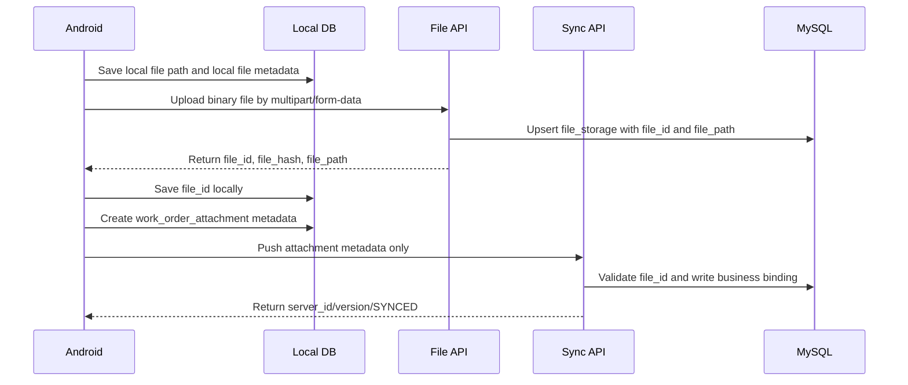

# Sync & File Contract

> Data-layer contract before formal API documentation. If this document conflicts with SQL migration files, use the SQL files as the source of truth.

## 1. Core Rules

1. Mobile is offline-first: field records, photos, videos, audio notes, signatures, PDF metadata, and offline AI results are written to local SQLite/Realm/Room first.
2. MySQL is the authoritative server database. After successful sync, server returns `server_id`, `version`, and `updated_at`.
3. Large files must not be sent in business sync payloads. File body upload and business metadata sync are separate.
4. Conflicts must never be discarded. Write `sync_conflict` for PC review.
5. AI assists acceptance only. Manual acceptance and review decide the final result.

## 2. Large File Sequence

### Forbidden

- Do not put image/video/audio/PDF/signature Base64 into `/api/sync/push`.
- Do not store file BLOBs in MySQL.
- Do not store naked local file paths as backend access paths.

### Standard Photo Flow

## 3. Version Matrix

| Case | Condition | Server Action | Write Business Table | Write `sync_conflict` | Response |
|---|---|---|---|---|---|
| New create | `server_id IS NULL` and `local_id` not found | Insert and set `version=1` | Yes | No | `SYNCED`, `server_id`, `version=1` |
| Idempotent create | `server_id IS NULL` and `local_id` exists | Return existing mapping | No | No | Existing `server_id/version` |
| Normal update | `client.version == server.version` | Update and `version+1` | Yes | No | `SYNCED`, new version |
| Client stale | `client.version < server.version` | Stop update | No | Yes | `CONFLICT`, `conflict_id` |
| Client ahead | `client.version > server.version` | Mark abnormal | No | Yes or failed log | `FAILED` or `CONFLICT` |
| Update after delete | Server `deleted_flag=1` and client updates | Stop update | No | Yes | `CONFLICT` |
| Delete after update | Client delete based on old version | Stop update | No | Yes | `CONFLICT` |
| Acceptance locked | `locked_flag=1` and client changes key fields | Stop update | No | Yes | `CONFLICT` |

## 4. Conflict Record Requirements

When a conflict occurs, backend must:

1. Insert `sync_log` with `sync_status=CONFLICT`.
2. Insert `sync_conflict` with `conflict_no`, `sync_task_id`, `sync_log_id`, `device_id`, `operator_id`, `entity_type`, `server_id`, `local_id`, `work_order_id`, `business_no`, `base_version`, `client_version`, `server_version`, `conflict_fields`, `old_payload`, `client_payload`, and `server_payload`.
3. Use `LAST_WRITE_WINS` as default strategy but keep manual PC review.
4. Optionally mark business table `sync_status=CONFLICT` and `conflict_flag=1`.

## 5. PC Review Strategies

| Strategy | Meaning | Result |
|---|---|---|
| `KEEP_SERVER` | Keep server value | Conflict becomes `RESOLVED`; no business overwrite. |
| `KEEP_CLIENT` | Accept client payload | Business table updates and `version+1`. |
| `MANUAL_MERGE` | PC merges fields | Write `final_payload` to business table. |
| `IGNORE_CLIENT` | Ignore client payload | Conflict becomes `IGNORED`. |

Resolution must write `resolver_id`, `resolve_time`, `resolve_comment`, and `work_order_version_log`.

## 6. Payload Boundary

| Allowed in `/api/sync/push` | Forbidden in `/api/sync/push` |
|---|---|
| `file_id` | Image Base64 |
| `file_type` | Video binary |
| `file_size` | Audio binary |
| `mime_type` | PDF binary |
| `file_hash/checksum` | Original large file content |
| `work_order_id/record_id` | Local absolute path as server URL |
| Watermark text, GPS, capture time | Sensitive raw EXIF |

## 7. API Draft Scope

- `POST /api/files/upload`: upload binary file and return `file_id`.
- `POST /api/sync/push`: mobile pushes incremental business data.
- `POST /api/sync/pull`: mobile pulls server increments.
- `POST /api/sync/ack`: mobile acknowledges applied changes.
- `GET /api/admin/sync/conflicts`: PC conflict list.
- `POST /api/admin/sync/conflicts/{id}/resolve`: PC resolves conflict.
- `GET /api/files/{file_id}/preview`: PC preview.
- `GET /api/files/{file_id}/download`: PC download.
